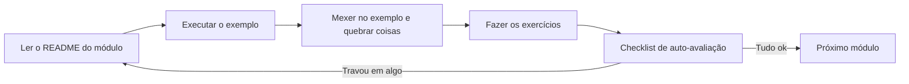

# Guia do Aluno

Este guia resolve a parte chata antes da parte divertida: deixar seu computador pronto para compilar e executar Java, e ensinar o fluxo de trabalho que usaremos em todos os módulos.

## 1. Instalando o que é necessário

### JDK (Java Development Kit)

O JDK é o kit que contém o compilador (`javac`) e a máquina virtual (`java`). Recomendamos o **JDK 21 ou mais recente**.

1. Baixe o [Eclipse Temurin](https://adoptium.net/) (gratuito) ou o JDK da Oracle.
2. Instale aceitando as opções padrão (no Windows, marque a opção de adicionar ao PATH se aparecer).
3. Confirme no terminal:

```bash
java -version
javac -version
```

Se os dois comandos mostrarem a versão, está tudo certo. Se aparecer "comando não encontrado", o JDK não está no PATH — peça ajuda ao professor ou procure "adicionar JDK ao PATH" para seu sistema.

### Editor: VS Code

1. Instale o [Visual Studio Code](https://code.visualstudio.com/).
2. Dentro dele, instale a extensão **Extension Pack for Java** (da Microsoft).
3. Com essa extensão, um botão "Run" aparece em cima de todo método `main` — é o jeito mais fácil de executar os exemplos.

## 2. Como compilar e executar os exemplos

Todos os módulos seguem a mesma estrutura, então o processo é sempre igual. Exemplo com o módulo 02:

```bash
cd modulo-02-classes-e-objetos/exemplo

# Compilar (o -d bin manda os .class para a pasta bin)
javac -d bin model/*.java app/*.java

# Executar (repare que usamos o nome completo: pacote.Classe)
java -cp bin app.TestePessoa
```

Regras gerais:

- Compile **a partir da pasta `exemplo/`** do módulo, nunca de dentro de `model/` ou `app/`.
- Se o módulo tiver `util/` ou `exception/`, inclua no `javac`: `javac -d bin model/*.java util/*.java app/*.java`
- A classe executável (a que tem `main`) está sempre no pacote `app`.
- Nos módulos 00, 01 e 09 (versão "antes") os arquivos não têm pacote: basta `javac Arquivo.java` e `java Arquivo`.

Pelo VS Code é ainda mais simples: abra o arquivo da pasta `app/` e clique em "Run" sobre o método `main`.

## 3. Como escrever o código: a convenção do repositório

Todos os exemplos e gabaritos seguem a mesma regra de acentuação, e espera-se o mesmo dos seus exercícios:

| Onde | Acento | Por quê |
| --- | --- | --- |
| Comentários e Javadoc | **Com acento**, português correto | O comentário existe para ser lido por gente. Ele nunca vai para a tela, então nada pode embaralhar |
| Mensagens de `System.out.println` | **Sem acento** | O texto vai para o console, e console é terreno traiçoeiro (veja abaixo) |
| Nomes de classes, métodos e variáveis | Sem acento, como manda o Java | `calcularMedia`, nunca `calcularMédia` |

```java
// Define uma nova idade para a pessoa, se ela passar na validação
public void setIdade(int idade) {
    if (!Validacoes.idadeValida(idade)) {
        System.out.println("Erro: a idade nao pode ser negativa!");
        return;
    }
    this.idade = idade;
}
```

Parece um detalhe bobo, mas resolve um problema real: no Windows, o terminal e o Java nem sempre combinam sobre a tabela de caracteres, e um `System.out.println("Olá")` pode aparecer como `Ol�`. Sem acento na string, **seu programa sai igual em qualquer computador do laboratório** — e você não perde meia aula caçando um erro que não é seu.

Se ainda assim você quiser acentos nas mensagens (no seu projeto final, por exemplo), use:

```bash
javac -encoding UTF-8 -d bin model/*.java app/*.java
java -Dstdout.encoding=UTF-8 -cp bin app.TestePessoa
```

Pelo botão "Run" do VS Code isso normalmente já vem resolvido.

## 4. Como fazer os exercícios

1. Leia o enunciado em `modulo-XX/exercicios/`.
2. Crie uma pasta para a sua solução **fora** das pastas de exemplo (sugestão: `minhas-solucoes/modulo-XX/` na raiz do repositório — essa pasta é sua).
3. Siga a estrutura de pacotes pedida no enunciado (geralmente `model/` e `app/`).
4. Compare a saída do seu programa com o "Exemplo de saída" do enunciado.
5. Passe pelos "Critérios de aceitação" do enunciado, um por um.
6. Só depois disso, se quiser, compare com o [gabarito](gabaritos/).

## 5. Fluxo de estudo recomendado



O passo C é sério: altere valores, remova um `private`, apague um `@Override`, veja o que o compilador reclama. Entender os erros é metade do aprendizado.

## 6. Onde pedir ajuda

- Releia a seção "Erros comuns" do módulo — provavelmente seu problema está lá.
- Consulte o [GLOSSARIO.md](GLOSSARIO.md) quando um termo não fizer sentido.
- Traga a dúvida para a aula: erro de compilação é assunto de aula, não motivo de vergonha.
