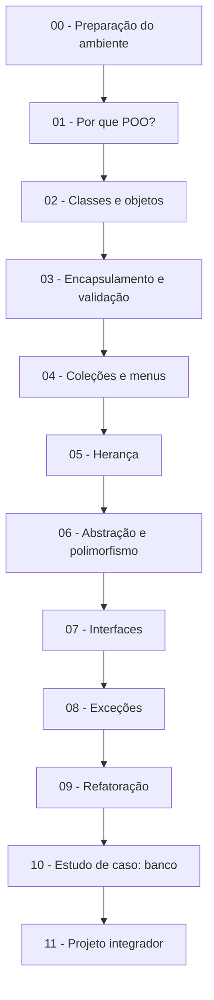

# Programação Orientada a Objetos com Java

Bem-vindo! Este repositório é a trilha oficial da disciplina de POO. Ele foi organizado como uma **sequência de módulos**: cada módulo é uma aula autocontida, com teoria, exemplo comentado, exercícios e um checklist para você saber se está pronto para avançar.

## Como estudar com este repositório

1. **Siga a ordem dos módulos.** Cada um assume que você concluiu o anterior.
2. Em cada módulo, **leia o README primeiro** (a teoria), depois **execute o código de `exemplo/`** e só então **faça os exercícios** de `exercicios/`.
3. Use o **checklist de auto-avaliação** no fim de cada módulo. Se algum item falhar, revise antes de seguir.
4. Só consulte a pasta [gabaritos/](gabaritos/) **depois de tentar de verdade**. Errar tentando ensina mais do que ler a resposta.
5. Nunca programou ou nunca configurou o Java? Comece pelo [GUIA-DO-ALUNO.md](GUIA-DO-ALUNO.md).

## A trilha de aprendizagem



| Módulo | Tema | O que você vai aprender |
| --- | --- | --- |
| [00](modulo-00-preparacao/) | Preparação do ambiente | Instalar o JDK, compilar e executar seu primeiro programa |
| [01](modulo-01-por-que-poo/) | Por que POO? | O problema que a orientação a objetos resolve, comparando o mesmo programa em duas versões |
| [02](modulo-02-classes-e-objetos/) | Classes e objetos | Classe, objeto, atributo, método, construtor, `this` |
| [03](modulo-03-encapsulamento-e-validacao/) | Encapsulamento e validação | `private`, getters e setters, proteção dos dados do objeto |
| [04](modulo-04-colecoes-e-menus/) | Coleções e menus | `ArrayList`, `Scanner`, menus interativos, CRUD em memória |
| [05](modulo-05-heranca/) | Herança | `extends`, `super`, `@Override`, reaproveitamento de código |
| [06](modulo-06-abstracao-e-polimorfismo/) | Abstração e polimorfismo | Classes e métodos abstratos, sobrecarga, sobrescrita, polimorfismo |
| [07](modulo-07-interfaces/) | Interfaces | Contratos entre classes, `implements`, múltiplas interfaces |
| [08](modulo-08-excecoes/) | Exceções | `try/catch/finally`, `throw`, `throws`, exceções personalizadas |
| [09](modulo-09-refatoracao/) | Refatoração | Extrair métodos e classes, eliminar repetição, melhorar nomes |
| [10](modulo-10-estudo-de-caso-banco/) | Estudo de caso: banco | Um sistema completo que integra tudo que foi visto |
| [11](modulo-11-projeto-integrador/) | Projeto integrador | Você constrói seu próprio sistema, do zero |

## Os 4 pilares da POO e onde eles aparecem

A orientação a objetos se apoia em quatro ideias centrais. Elas são apresentadas aos poucos, sempre com código:

| Pilar | Em uma frase | Módulos |
| --- | --- | --- |
| Encapsulamento | Cada objeto protege seus dados e só expõe o necessário | 03, 04 |
| Herança | Classes podem reaproveitar e especializar outras classes | 05 |
| Polimorfismo | O mesmo comando se comporta diferente conforme o objeto real | 06, 07 |
| Abstração | Modelar só o que importa do problema, escondendo detalhes | 01, 06, 07 |

## Estrutura de cada módulo

```text
modulo-XX-nome/
├── README.md        <- a aula: teoria, exemplo explicado, erros comuns
├── exemplo/         <- código pronto para compilar e estudar
│   ├── model/       <- as classes de domínio (Pessoa, Conta, Aluno...)
│   ├── app/         <- as classes executáveis (com o método main)
│   ├── util/        <- classes auxiliares (validações), quando houver
│   └── exception/   <- exceções personalizadas, quando houver
└── exercicios/      <- enunciados para você resolver
```

Essa separação em pacotes (`model`, `app`, `util`, `exception`) é uma convenção usada em todos os módulos e muito parecida com a que você encontrará em projetos profissionais.

## Material de apoio

- [GUIA-DO-ALUNO.md](GUIA-DO-ALUNO.md) — como instalar tudo e como compilar e executar os projetos.
- [GLOSSARIO.md](GLOSSARIO.md) — todos os termos de POO explicados em linguagem simples.
- [material-apoio/resumo-sintaxe.md](material-apoio/resumo-sintaxe.md) — cola rápida da sintaxe Java usada nos módulos.
- [material-apoio/rubrica-avaliacao.md](material-apoio/rubrica-avaliacao.md) — como os exercícios são avaliados.
- [gabaritos/](gabaritos/) — resoluções comentadas dos exercícios (use com responsabilidade).

## Público-alvo

Estudantes de tecnologia e iniciantes em Java que queiram aprender POO de forma aplicada, além de quem deseja revisar os fundamentos com uma progressão organizada.
