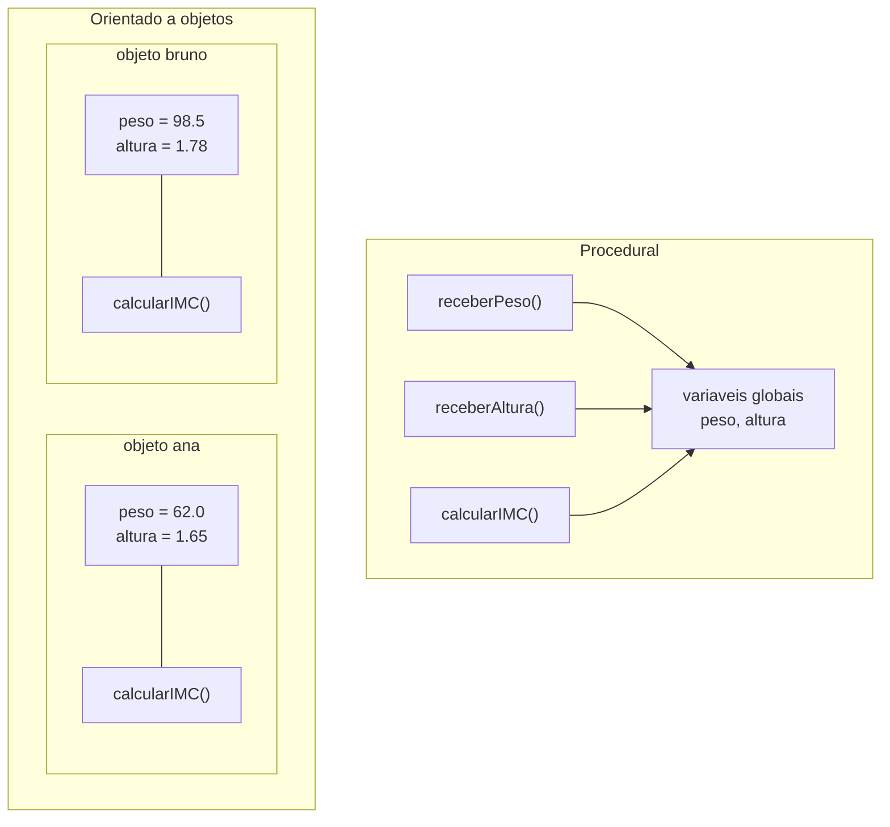

# Módulo 01 — Por que Programação Orientada a Objetos?

Antes de aprender **como** usar POO, você merece saber **por que** ela existe. Este módulo apresenta o mesmo programa escrito de dois jeitos e deixa você tirar as conclusões.

## Objetivos de aprendizagem

Ao final deste módulo você será capaz de:

- [ ] Explicar as limitações do estilo procedural quando o programa cresce
- [ ] Reconhecer a ideia central da POO: juntar dados e comportamento
- [ ] Citar os 4 pilares da POO e dizer, em uma frase, o que cada um significa
- [ ] Apontar, em um código dado, o que é abstração

## Pré-requisitos

[Módulo 00](../modulo-00-preparacao/) concluído: você compila e executa Java sem sofrimento.

## O experimento: um programa, dois paradigmas

Na pasta [exemplo/](exemplo/) há duas versões de uma calculadora de IMC:

| Pasta | Estilo | Característica |
| --- | --- | --- |
| `versao-procedural/` | Procedural | Funções soltas (`static`) operando sobre variáveis soltas |
| `versao-poo/` | Orientado a objetos | Uma classe `Pessoa` que junta os dados e os cálculos |

Execute as duas:

```bash
cd exemplo/versao-procedural
javac CalculadoraIMC.java
java CalculadoraIMC

cd ../versao-poo
javac *.java
java App
```

### Lendo a versão procedural

Abra [exemplo/versao-procedural/CalculadoraIMC.java](exemplo/versao-procedural/CalculadoraIMC.java). Repare:

- `peso` e `altura` são variáveis estáticas soltas, visíveis para todo o arquivo.
- As funções `receberPeso()`, `calcularIMC()` etc. dependem dessas variáveis globais.
- Funciona bem! Para um programa deste tamanho, o estilo procedural dá conta.

Agora o teste mental que muda tudo: **e se o programa precisar calcular o IMC de duas pessoas ao mesmo tempo?** Você precisaria de `peso1`, `altura1`, `peso2`, `altura2`... e cada função precisaria saber de qual pessoa está falando. Com dez pessoas, o código vira um nó.

### Lendo a versão POO

Abra [exemplo/versao-poo/Pessoa.java](exemplo/versao-poo/Pessoa.java). A mudança de mentalidade:

- Peso e altura deixam de ser variáveis soltas e viram **atributos** de `Pessoa`.
- `calcularIMC()` deixa de ser uma função solta e vira um **método**: a pessoa calcula o *próprio* IMC.
- Precisamos de dez pessoas? `new Pessoa(...)` dez vezes. Cada objeto carrega seus dados.



À esquerda, todas as funções disputam as mesmas variáveis. À direita, cada objeto é um "pacote fechado" de dados + comportamento. Essa é a ideia central de toda a disciplina.

## Abstração: a primeira decisão de projeto

Ao criar a classe `Pessoa` para uma calculadora de IMC, escolhemos guardar **nome, peso e altura** — e mais nada. Uma pessoa real tem CPF, endereço, cor preferida... mas nada disso importa para calcular IMC.

**Abstrair é decidir o que entra no modelo e o que fica de fora**, guiado pelo problema que se quer resolver. A mesma "pessoa" seria modelada com outros atributos num sistema de RH (salário, cargo) ou num hospital (tipo sanguíneo, alergias). Não existe modelo certo universal: existe modelo adequado ao problema.

Você fará essa decisão em todos os exercícios do curso a partir de agora.

## Os 4 pilares (apresentação rápida)

Guarde os nomes; cada um terá seu próprio módulo:

1. **Abstração** — modelar só o que importa para o problema (você acabou de ver).
2. **Encapsulamento** — o objeto protege seus dados e controla o acesso a eles (módulo 03).
3. **Herança** — classes reaproveitam e especializam outras classes (módulo 05).
4. **Polimorfismo** — o mesmo comando se comporta diferente conforme o objeto (módulos 06 e 07).

## Auto-avaliação

- [ ] Consigo explicar com minhas palavras por que a versão procedural escala mal
- [ ] Consigo apontar no código onde os dados e o comportamento "se juntaram"
- [ ] Sei dizer o que foi abstraído (deixado de fora) na classe `Pessoa`
- [ ] Decorei os nomes dos 4 pilares

## Para discutir em aula

- A versão procedural é "errada"? (Dica: não. A questão é escala e manutenção.)
- Que atributos você escolheria para uma classe `Pessoa` de um app de banco? E de uma rede social?

---

Anterior: [Módulo 00](../modulo-00-preparacao/) | Próximo: [Módulo 02 — Classes e objetos](../modulo-02-classes-e-objetos/)
