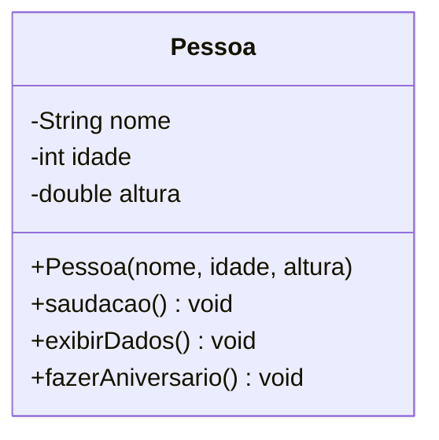

# Módulo 02 — Classes e objetos

Hora de construir suas primeiras classes de verdade. Este módulo é a fundação de todos os módulos seguintes: se estes conceitos ficarem sólidos, os próximos módulos serão muito mais fáceis.

Este módulo é propositalmente pequeno. Você vai ver só o essencial — classe, objeto, atributo, método, `new`. Getters, setters, `toString()` e mais de um construtor ficam para os módulos seguintes: cada ideia nova merece sua própria aula, sem competir por atenção com as outras.

## Objetivos de aprendizagem

Ao final deste módulo você será capaz de:

- [ ] Criar uma classe com atributos e métodos
- [ ] Instanciar objetos com `new` e entender que cada um é independente
- [ ] Escrever um construtor que inicializa todos os atributos
- [ ] Escrever métodos que leem e alteram os atributos do próprio objeto

## Pré-requisitos

[Módulo 01](../modulo-01-por-que-poo/) concluído: você entende POR QUE juntamos dados e comportamento.

## Conceito

### Classe = molde; objeto = coisa feita no molde

Pense em uma forma de bolo (classe) e nos bolos (objetos). A forma define o formato de todo bolo; cada bolo, porém, é um bolo — pode ter sabor diferente, ser comido sem afetar os outros.



Este é um **diagrama de classes**, a "planta baixa" que usaremos em todos os módulos. O `-` indica privado, o `+` indica público — o porquê de `private` vem no [módulo 04](../modulo-04-encapsulamento/); por ora, saiba apenas que os atributos moram dentro do objeto e só os métodos dele mexem neles.

### O construtor

O construtor é chamado uma única vez por objeto, no momento do `new`. A missão dele é entregar o objeto pronto:

```java
Pessoa maria = new Pessoa("Maria", 30, 1.65);
//             ^^^ aqui o construtor executa
```

### O this

Dentro da classe, `this` significa "este objeto aqui". O uso mais comum é desambiguar nomes:

```java
public Pessoa(String nome, int idade, double altura) {
    this.nome = nome;     // this.nome = atributo; nome = parametro
    this.idade = idade;
    this.altura = altura;
}
```

Sem o `this`, a linha `nome = nome;` atribuiria o parâmetro a ele mesmo e o atributo ficaria vazio — um erro clássico que o compilador NÃO acusa.

### Métodos podem mudar o estado do objeto

Um objeto não é só uma caixa de dados: seus métodos podem alterar os próprios atributos. Repare no `fazerAniversario()` do exemplo — ele muda `idade` sem precisar de nenhum mecanismo especial, só o método fazendo o que uma pessoa faria.

## Exemplo guiado

O código está em [exemplo/](exemplo/):

- [model/Pessoa.java](exemplo/model/Pessoa.java) — a classe com um construtor, dois métodos de leitura e um método que muda o estado do objeto.
- [app/TestePessoa.java](exemplo/app/TestePessoa.java) — cria objetos e exercita cada método.

Roteiro de leitura sugerido:

1. Leia `Pessoa.java` de cima para baixo.
2. Leia `TestePessoa.java` e preveja no papel o que será impresso.
3. Execute e confira sua previsão:

   ```bash
   cd exemplo
   javac -d bin model/*.java app/*.java
   java -cp bin app.TestePessoa
   ```

4. Experimente: crie uma terceira `Pessoa` no `TestePessoa`, chame `fazerAniversario()` nela e prove que as outras duas não mudaram.

## Exercícios

1. [EXERCICIO-01-produto.md](exercicios/EXERCICIO-01-produto.md) — fixação: uma classe única, com um método que muda o estado do objeto.

> Este módulo ainda vai ganhar mais exercícios (aplicação e desafio) numa próxima revisão do material.

## Auto-avaliação

- [ ] Sei explicar a diferença entre classe e objeto com um exemplo meu (não o do bolo)
- [ ] Sei por que `this.nome = nome` precisa do `this`
- [ ] Criei dois objetos da mesma classe e provei que são independentes
- [ ] Escrevi um método que muda um atributo do próprio objeto

## Erros comuns

| Erro | O que está acontecendo |
| --- | --- |
| `nome = nome;` no construtor | Faltou `this.` — o atributo fica `null` e nada avisa |
| `Pessoa p; p.saudacao();` | Declarou mas não instanciou: `NullPointerException`. Falta o `new` |
| Criar um construtor com retorno (`public void Pessoa(...)`) | Com `void` deixa de ser construtor e vira um método comum que nunca é chamado |
| Imprimir o objeto com `System.out.println(pessoa)` | Aparece algo como `model.Pessoa@1b6d3586` — é o comportamento padrão do Java sem `toString()` sobrescrito, não um bug. Você resolve isso no [módulo 04](../modulo-04-encapsulamento/) |

---

Anterior: [Módulo 01](../modulo-01-por-que-poo/) | Próximo: [Módulo 03 — Construtores e sobrecarga](../modulo-03-construtores-e-sobrecarga/)
