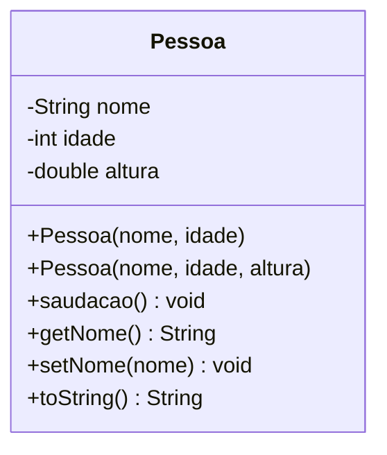

# Módulo 02 — Classes e objetos

Hora de construir suas primeiras classes de verdade. Este módulo é a fundação de todos os módulos seguintes: se estes conceitos ficarem sólidos, os próximos módulos serão muito mais fáceis.

## Objetivos de aprendizagem

Ao final deste módulo você será capaz de:

- [ ] Criar uma classe com atributos e métodos
- [ ] Instanciar objetos com `new` e entender que cada um é independente
- [ ] Escrever construtores, inclusive mais de um (sobrecarga de construtor)
- [ ] Usar `this` para se referir ao próprio objeto
- [ ] Sobrescrever `toString()` para imprimir objetos de forma legível

## Pré-requisitos

[Módulo 01](../modulo-01-por-que-poo/) concluído: você entende POR QUE juntamos dados e comportamento.

## Conceito

### Classe = molde; objeto = coisa feita no molde

Pense em uma forma de bolo (classe) e nos bolos (objetos). A forma define o formato de todo bolo; cada bolo, porém, é um bolo — pode ter sabor diferente, ser comido sem afetar os outros.



Este é um **diagrama de classes**, a "planta baixa" que usaremos em todos os módulos. O `-` indica privado, o `+` indica público — isso importa no módulo 03.

### O construtor

O construtor é chamado uma única vez por objeto, no momento do `new`. A missão dele é entregar o objeto pronto e válido:

```java
Pessoa maria = new Pessoa("Maria", 30);
//             ^^^ aqui o construtor executa
```

Uma classe pode ter **vários construtores**, desde que os parâmetros sejam diferentes — o Java escolhe pelo que você passar. Isso se chama sobrecarga, e você vai ver na prática no exemplo.

### O this

Dentro da classe, `this` significa "este objeto aqui". O uso mais comum é desambiguar nomes:

```java
public Pessoa(String nome, int idade) {
    this.nome = nome;   // this.nome = atributo; nome = parametro
    this.idade = idade;
}
```

Sem o `this`, a linha `nome = nome;` atribuiria o parâmetro a ele mesmo e o atributo ficaria vazio — um erro clássico que o compilador NÃO acusa.

## Exemplo guiado

O código está em [exemplo/](exemplo/):

- [model/Pessoa.java](exemplo/model/Pessoa.java) — a classe com 3 construtores, getters, setters e `toString()`.
- [app/TestePessoa.java](exemplo/app/TestePessoa.java) — cria objetos e exercita cada método.

Roteiro de leitura sugerido:

1. Leia `Pessoa.java` de cima para baixo. Repare que cada construtor inicializa TODOS os atributos.
2. Leia `TestePessoa.java` e preveja no papel o que será impresso.
3. Execute e confira sua previsão:

   ```bash
   cd exemplo
   javac -d bin model/*.java app/*.java
   java -cp bin app.TestePessoa
   ```

4. Experimente: crie um quarto objeto no `TestePessoa`, mude o nome de um objeto e imprima os dois — comprove que um não afeta o outro.

## Exercícios

Faça na ordem — o primeiro aquece, o segundo consolida:

1. [EXERCICIO-01-produto.md](exercicios/EXERCICIO-01-produto.md) — fixação: uma classe única bem simples.
2. [EXERCICIO-02-biblioteca.md](exercicios/EXERCICIO-02-biblioteca.md) — aplicação: duas classes interagindo.

## Auto-avaliação

- [ ] Sei explicar a diferença entre classe e objeto com um exemplo meu (não o do bolo)
- [ ] Sei por que `this.nome = nome` precisa do `this`
- [ ] Criei dois objetos da mesma classe e provei que são independentes
- [ ] Sei o que acontece se eu imprimir um objeto sem sobrescrever `toString()`

## Erros comuns

| Erro | O que está acontecendo |
| --- | --- |
| `nome = nome;` no construtor | Faltou `this.` — o atributo fica `null` e nada avisa |
| `Pessoa p; p.getNome();` | Declarou mas não instanciou: `NullPointerException`. Falta o `new` |
| Criar um construtor com retorno (`public void Pessoa(...)`) | Com `void` deixa de ser construtor e vira um método comum que nunca é chamado |
| Imprimir o objeto e ver `model.Pessoa@1b6d3586` | `toString()` não foi sobrescrito — isso é o comportamento padrão, não um bug |

---

Anterior: [Módulo 01](../modulo-01-por-que-poo/) | Próximo: [Módulo 03 — Encapsulamento e validação](../modulo-03-encapsulamento-e-validacao/)
