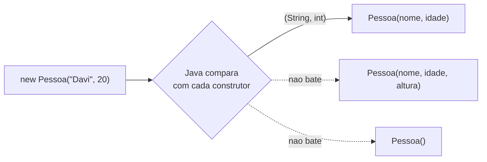

# Módulo 03 — Construtores e sobrecarga

Uma classe pode ter mais de um construtor. Este módulo explica a regra que permite isso — a **sobrecarga** — e por que ela é útil: dar ao aluno mais de uma forma de criar o mesmo tipo de objeto.

## Objetivos de aprendizagem

Ao final deste módulo você será capaz de:

- [ ] Escrever mais de um construtor na mesma classe
- [ ] Explicar a regra da sobrecarga: mesmo nome, parâmetros diferentes
- [ ] Prever qual construtor o Java vai chamar, dado um `new` específico
- [ ] Reconhecer um erro de compilação causado por dois construtores com a mesma assinatura

## Pré-requisitos

[Módulo 02](../modulo-02-classes-e-objetos/) concluído: você já sabe escrever uma classe com um construtor, atributos e métodos.

## Conceito

### O problema: um construtor só não basta

No módulo 02, `Pessoa` tinha um único construtor, que exigia nome, idade e altura sempre. Mas nem todo `Pessoa` que você vai criar tem a altura à mão no momento da criação. Forçar quem usa a classe a inventar um valor é ruim; não ter opção nenhuma também é ruim.

A solução do Java: **uma classe pode ter vários construtores**, desde que cada um seja diferente dos outros de um jeito que o compilador consiga distinguir.

### A regra da sobrecarga (overload)

Dois métodos (ou construtores) podem ter o **mesmo nome** na mesma classe, desde que a **assinatura** seja diferente. Assinatura = nome + quantidade e tipos dos parâmetros (o tipo de retorno não conta).

```java
public Pessoa(String nome, int idade) { ... }                // assinatura: (String, int)
public Pessoa(String nome, int idade, double altura) { ... }  // assinatura: (String, int, double)
public Pessoa() { ... }                                        // assinatura: ()
```

As três são válidas porque nenhuma tem a mesma lista de parâmetros que outra. Quando você escreve `new Pessoa("Davi", 20)`, o Java compara os argumentos com cada construtor disponível e escolhe o que bate — isso se chama **resolução de sobrecarga**, e acontece em tempo de compilação.

O que **não** é sobrecarga válida: mudar só o nome do parâmetro.

```java
public Pessoa(String nome, int idade) { ... }
public Pessoa(String apelido, int anos) { ... }   // ERRO: mesma assinatura (String, int)
```

Para o compilador, nomes de parâmetro não existem — só importam os tipos, a ordem e a quantidade.



### Por que isso não é a mesma coisa que sobrescrita

Você vai ouvir os dois termos o curso inteiro; eles não têm nada a ver um com o outro:

| | Sobrecarga (Overload) |
| --- | --- |
| Onde | Vários métodos/construtores **na mesma classe** |
| Nome | O mesmo |
| Parâmetros | Diferentes (tipo e/ou quantidade) |
| Quando o Java decide | Em tempo de **compilação**, olhando os argumentos do `new`/chamada |

Existe um segundo termo parecido no nome — **sobrescrita** (override) — que só faz sentido quando uma classe herda de outra e reescreve um método da classe mãe. Como herança ainda não foi vista, sobrescrita fica para o [módulo 11](../modulo-11-sobrescrita-e-polimorfismo/), quando fizer sentido comparar os dois lado a lado.

## Exemplo guiado

- [model/Pessoa.java](exemplo/model/Pessoa.java) — a classe com 3 construtores sobrecarregados.
- [app/TestePessoa.java](exemplo/app/TestePessoa.java) — cria um objeto com cada construtor.

```bash
cd exemplo
javac -d bin model/*.java app/*.java
java -cp bin app.TestePessoa
```

Roteiro de leitura:

1. Leia os 3 construtores de `Pessoa.java` e para cada um escreva no papel: "isso é chamado quando eu escrevo `new Pessoa(...)` com ___".
2. Em `TestePessoa.java`, antes de rodar, escreva ao lado de cada `new Pessoa(...)` qual construtor você acha que vai ser chamado.
3. Execute e confira.
4. Experimente: adicione um quarto construtor que recebe só a `idade` (um `int`). Ele compila? Por quê?

## Exercícios

1. [EXERCICIO-01-formas-geometricas.md](exercicios/EXERCICIO-01-formas-geometricas.md) — fixação: uma classe com construtores sobrecarregados.

> Este módulo ainda vai ganhar mais exercícios (aplicação e desafio) numa próxima revisão do material.

## Auto-avaliação

- [ ] Sei escrever dois construtores diferentes na mesma classe sem erro de compilação
- [ ] Sei explicar, com minhas palavras, por que dois construtores com os mesmos tipos de parâmetro dão erro
- [ ] Sei prever qual construtor o Java escolhe, olhando só para o `new`
- [ ] Sei dizer a diferença entre sobrecarga e sobrescrita, mesmo sem ainda ter visto a segunda em código

## Erros comuns

| Erro | O que está acontecendo |
| --- | --- |
| `constructor Pessoa(String,int) is already defined` | Dois construtores com a mesma assinatura — o Java não sabe qual escolher |
| Mudar só o nome do parâmetro achando que sobrecarregou | Sobrecarga exige TIPOS ou QUANTIDADE diferentes, não nomes |
| Esquecer um construtor sem parâmetros e depender só do completo | Não é erro, mas tira flexibilidade de quem usa a classe |
| Confundir sobrecarga com sobrescrita | Sobrecarga é vários métodos na MESMA classe; sobrescrita precisa de herança (módulo 11) |

---

Anterior: [Módulo 02](../modulo-02-classes-e-objetos/) | Próximo: [Módulo 04 — Encapsulamento](../modulo-04-encapsulamento/)
