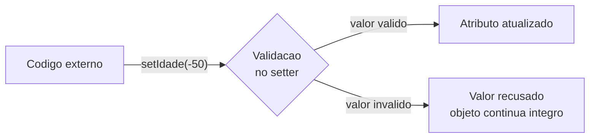

# Módulo 03 — Encapsulamento e validação

No módulo anterior seus objetos já nasciam com dados. Neste, eles aprendem a **se proteger**: ninguém mais vai conseguir colocar uma idade de -50 anos numa `Pessoa`.

## Objetivos de aprendizagem

Ao final deste módulo você será capaz de:

- [ ] Explicar o que é encapsulamento e por que atributos são `private`
- [ ] Escrever setters que validam antes de aceitar um valor
- [ ] Criar uma classe utilitária de validações com métodos `static`
- [ ] Explicar a diferença entre um método de instância e um método `static`

## Pré-requisitos

[Módulo 02](../modulo-02-classes-e-objetos/) concluído, exercícios feitos.

## Conceito

### O problema: dados desprotegidos

Se `idade` fosse `public`, qualquer linha do programa poderia fazer:

```java
maria.idade = -50;   // e nada impede
```

Num programa com milhares de linhas, encontrar QUEM estragou o dado é um pesadelo. O encapsulamento resolve invertendo o controle: **o próprio objeto é o guardião dos seus dados**.

### A receita do encapsulamento

1. Atributos `private` — só a própria classe enxerga.
2. Leitura via getter — `getIdade()`.
3. Escrita via setter **com validação** — o setter é a alfândega do objeto:

```java
public void setIdade(int idade) {
    if (idade < 0 || idade > 150) {
        System.out.println("Idade invalida: " + idade);
        return;              // recusa o valor, o atributo nao muda
    }
    this.idade = idade;
}
```



Regra de ouro: **não existe caminho para o atributo que passe por fora da validação**. É isso que garante que o objeto nunca fica num estado inválido.

### Classes utilitárias e o static

Repare no exemplo que as regras de validação moram em [util/Validacoes.java](exemplo/util/Validacoes.java), com métodos `static`:

```java
if (Validacoes.validarIdade(idade)) { ... }   // sem new
```

`static` significa que o método pertence à **classe**, não a um objeto. Faz sentido aqui: validar uma idade não depende de nenhum estado — é uma função pura de apoio. Também evita repetir a mesma regra em todo setter do sistema (você verá essa ideia de "não repetir" ganhar nome no módulo 09).

Cuidado com a tentação: se TUDO no seu programa é `static`, você voltou ao estilo procedural do módulo 01.

## Exemplo guiado

- [model/Pessoa.java](exemplo/model/Pessoa.java) — a mesma Pessoa do módulo 02.
- [util/Validacoes.java](exemplo/util/Validacoes.java) — validações de nome (não vazio, sem dígitos) e idade (0 a 150).
- [app/MenuPessoa.java](exemplo/app/MenuPessoa.java) — um menu de console que só altera a Pessoa depois de validar a entrada.

```bash
cd exemplo
javac -d bin model/*.java util/*.java app/*.java
java -cp bin app.MenuPessoa
```

Use o menu e tente ativamente quebrar o programa: idade negativa, nome com números, nome vazio. Observe que o objeto sobrevive intacto a todas as tentativas.

## Exercícios

1. [EXERCICIO-01-conta-de-jogador.md](exercicios/EXERCICIO-01-conta-de-jogador.md) — construa uma classe blindada por validações.

## Auto-avaliação

- [ ] Sei explicar por que `public` nos atributos é perigoso
- [ ] Meus setters recusam valores inválidos (testei com valores absurdos)
- [ ] Sei decidir quando um método merece ser `static` e quando não
- [ ] Entendi por que o construtor também deve validar (ou usar os setters)

## Erros comuns

| Erro | O que está acontecendo |
| --- | --- |
| Validar no setter mas não no construtor | O objeto nasce inválido; a validação vira decoração |
| Getter devolvendo referência de objeto mutável interno | Quem recebe pode modificar por fora — tema avançado, guarde a pulga atrás da orelha |
| Colocar `static` em tudo | Programa procedural disfarçado de POO |
| Setter que imprime erro mas atribui mesmo assim | Faltou o `return` após detectar o valor inválido |

---

Anterior: [Módulo 02](../modulo-02-classes-e-objetos/) | Próximo: [Módulo 04 — Coleções e menus](../modulo-04-colecoes-e-menus/)
