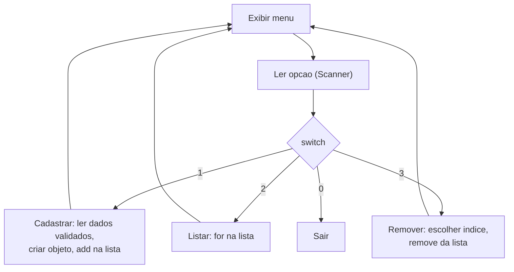

# Módulo 04 — Coleções e menus interativos

Até agora criamos dois ou três objetos "na mão". Sistemas reais gerenciam **muitos** objetos: cadastrar, listar, buscar, remover. Neste módulo você constrói seu primeiro sistema completo de console — uma academia.

## Objetivos de aprendizagem

Ao final deste módulo você será capaz de:

- [ ] Guardar objetos em um `ArrayList` e percorrê-los com `for`
- [ ] Ler dados do usuário com `Scanner`, com validação
- [ ] Montar um menu interativo com laço `do/while` e `switch`
- [ ] Implementar as operações de um CRUD em memória (criar, listar, remover)
- [ ] Explicar o que `equals` e `hashCode` fazem e por que coleções dependem deles

## Pré-requisitos

[Módulo 03](../modulo-03-encapsulamento-e-validacao/) concluído — as validações de lá serão usadas aqui o tempo todo.

## Conceito

### ArrayList: a prateleira de objetos

Um array comum (`Aluno[10]`) tem tamanho fixo. O `ArrayList` cresce sozinho:

```java
List<Aluno> alunos = new ArrayList<>();
alunos.add(new Aluno("Ana", 25, 1));   // guarda
alunos.get(0);                          // pega pelo indice
alunos.size();                          // quantos tem
alunos.remove(0);                       // remove pelo indice
```

O `<Aluno>` (generics) avisa ao compilador: "esta lista só aceita Aluno". Tentar adicionar outra coisa nem compila — mais um erro pego de graça, antes de executar.

Para percorrer, o for-each é o mais legível:

```java
for (Aluno aluno : alunos) {
    System.out.println(aluno);   // usa o toString() de Aluno
}
```

### equals e hashCode: o que significa "ser igual"?

Uma pergunta que parece boba até morder: **quando dois objetos são iguais?** Rode este experimento mental:

```java
Aluno a = new Aluno("Ana", 25, 1);
Aluno b = new Aluno("Ana", 25, 1);
System.out.println(a == b);        // false!
System.out.println(a.equals(b));   // depende...
```

- `==` compara **referências**: "são o MESMO objeto na memória?" Dois `new` sempre criam objetos diferentes, então `a == b` é `false` mesmo com dados idênticos.
- `equals` deveria comparar **conteúdo** — mas a versão herdada de `Object` também compara referência. Ou seja: sem sobrescrever, `a.equals(b)` é `false` também.

Por que isso importa AGORA, no módulo de coleções? Porque a lista usa `equals` por baixo dos panos:

```java
alunos.contains(new Aluno("Ana", 25, 1));   // "ja existe essa aluna?"
alunos.remove(algumAluno);                   // remove QUEM for equals
alunos.indexOf(algumAluno);                  // procura por equals
```

Sem `equals` sobrescrito, `contains` responde `false` para uma aluna com dados idênticos — e seu sistema cadastra a Ana duas vezes. Abra [model/Aluno.java](exemplo/model/Aluno.java): ele sobrescreve `equals` comparando nome, idade e plano, campo a campo.

E o `hashCode`? É o par inseparável do `equals`, um "resumo numérico" do objeto que coleções como `HashSet` e `HashMap` (você as encontrará em breve na carreira) usam para localizar objetos rapidamente. A regra do contrato é uma só e vale decorar:

> Se dois objetos são `equals`, seus `hashCode` DEVEM ser iguais.

Por isso os dois são sempre sobrescritos **juntos**, usando os mesmos campos — repare no `Aluno.java` que é exatamente o que acontece. Sobrescrever só um deles quebra o contrato e causa bugs silenciosos (objetos que "somem" dentro de um `HashSet`).

Na prática, sua IDE gera os dois para você (no VS Code: clique direito, "Source Action", "Generate hashCode() and equals()"). O importante é saber QUANDO gerar — toda classe de domínio que vai morar numa coleção e ser buscada/comparada — e escolher os campos que definem a identidade do objeto.

### A anatomia de um sistema de console

Quase todo sistema interativo deste curso segue este esqueleto:



Memorize esse desenho: ele se repete no sistema bancário (módulo 10) e provavelmente no seu projeto final.

## Exemplo guiado: Sistema Academia

- [model/Aluno.java](exemplo/model/Aluno.java) — nome, idade e plano (1 = Básico, 2 = Premium).
- [model/Treino.java](exemplo/model/Treino.java) — exercício, séries, repetições e carga.
- [util/Validacoes.java](exemplo/util/Validacoes.java) — leitura validada de strings e inteiros com faixa (min/max).
- [app/Main.java](exemplo/app/Main.java) — o menu que amarra tudo.

```bash
cd exemplo
javac -d bin model/*.java util/*.java app/*.java
java -cp bin app.Main
```

Pontos para observar na leitura do `Main`:

1. As listas (`alunos`, `treinos`) são o "banco de dados" do sistema — tudo em memória, some ao fechar. Persistência em arquivo/banco é assunto para outra disciplina; aqui o foco é o modelo.
2. Nenhum dado entra num objeto sem passar por `Validacoes` — o módulo 03 em ação.
3. Cada opção do menu virou um método próprio (`cadastrarAluno()`, `listarAlunos()`...). Compare mentalmente com o que seria um `main` de 200 linhas.

## Exercícios

1. [EXERCICIO-01-agenda-de-contatos.md](exercicios/EXERCICIO-01-agenda-de-contatos.md) — seu primeiro CRUD completo, sozinho.

## Auto-avaliação

- [ ] Sei criar, popular e percorrer um `ArrayList` sem consultar exemplo
- [ ] Sei ler um inteiro do teclado sem o programa explodir se o usuário digitar texto
- [ ] Entendo por que remover item de uma lista durante um for-each dá problema
- [ ] Construí um menu do/while + switch do zero
- [ ] Sei explicar a diferença entre `==` e `equals`, e por que `hashCode` acompanha `equals`

## Erros comuns

| Erro | O que está acontecendo |
| --- | --- |
| `InputMismatchException` ao digitar texto onde se espera número | Falta tratar a entrada — veja como `Validacoes` resolve |
| `nextInt()` seguido de `nextLine()` lendo string vazia | O Enter fica no buffer do Scanner; consuma-o com um `nextLine()` extra |
| `IndexOutOfBoundsException` ao remover | Índice digitado pelo usuário fora do tamanho da lista — valide contra `lista.size()` |
| Modificar a lista dentro do for-each | `ConcurrentModificationException` — remova por índice fora do laço |
| Comparar objetos com `==` | Compara referências, não conteúdo — use `equals` (sobrescrito) |
| `contains` "não encontra" um objeto com os mesmos dados | A classe não sobrescreveu `equals` — a lista compara referências |
| Sobrescrever `equals` e esquecer `hashCode` | Contrato quebrado: o objeto se perde em `HashSet`/`HashMap` |

---

Anterior: [Módulo 03](../modulo-03-encapsulamento-e-validacao/) | Próximo: [Módulo 05 — Herança](../modulo-05-heranca/)
