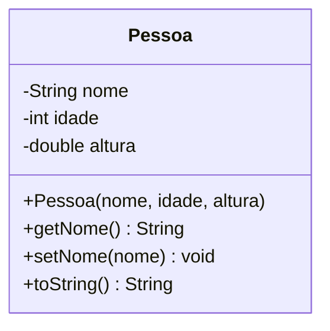

# Módulo 04 — Encapsulamento

Seus objetos até aqui expunham os atributos só através de métodos que você escolhia (como `exibirDados()`). Agora vamos formalizar isso: `private` nos atributos, e getters/setters como a única porta de entrada e saída dos dados. Ainda sem validação, que é assunto do próximo módulo.

## Objetivos de aprendizagem

Ao final deste módulo você será capaz de:

- [ ] Explicar o que é encapsulamento e por que atributos são `private`
- [ ] Escrever getters e setters
- [ ] Sobrescrever `toString()` para imprimir objetos de forma legível

## Pré-requisitos

[Módulo 03](../modulo-03-construtores-e-sobrecarga/) concluído.

## Conceito

### O problema: dados desprotegidos

Se `idade` fosse `public`, qualquer linha do programa poderia fazer:

```java
maria.idade = -50;   // e nada impede
```

Num programa com milhares de linhas, encontrar QUEM estragou o dado é um pesadelo. O encapsulamento resolve invertendo o controle: **o próprio objeto é o guardião dos seus dados**, e o acesso de fora só acontece através de métodos que o objeto escolhe expor.

### Getter e setter

- **Getter**: método que devolve o valor de um atributo. Convenção: `getNome()` devolve `nome`.
- **Setter**: método que altera o valor de um atributo. Convenção: `setNome(novoNome)` troca `nome`.

```java
private String nome;

public String getNome() {
    return nome;
}

public void setNome(String nome) {
    this.nome = nome;
}
```

Por enquanto o setter só atribui: ele ainda não recusa nada. Isso muda no [módulo 05](../modulo-05-validacao-e-integridade/), quando o setter vira a "alfândega" do objeto.

### toString(): imprimir o objeto de forma legível

Sem sobrescrever, `System.out.println(pessoa)` imprime algo como `model.Pessoa@1b6d3586`, o endereço do objeto na memória, não seus dados. Sobrescrevendo `toString()`, você decide o que aparece:

```java
@Override
public String toString() {
    return "Pessoa [nome=" + nome + ", idade=" + idade + ", altura=" + altura + "]";
}
```

O `@Override` avisa o compilador (e quem lê o código) que este método está substituindo um método que já existe na classe `Object`, da qual toda classe Java herda, mesmo sem você escrever `extends` em lugar nenhum. Herança de verdade só é ensinada no [módulo 10](../modulo-10-heranca/); por ora, basta saber que `toString()` é um método que toda classe já tem, e você está trocando o que ele devolve.



## Exemplo guiado

- [model/Pessoa.java](exemplo/model/Pessoa.java): a Pessoa do módulo 03, agora com atributos `private`, getters, setters e `toString()`.
- [app/TestePessoa.java](exemplo/app/TestePessoa.java): usa getters/setters e imprime o objeto direto.

```bash
cd exemplo
javac -d bin model/*.java app/*.java
java -cp bin app.TestePessoa
```

Experimente: no `TestePessoa`, tente escrever `pessoa.nome = "Ana";` direto (sem passar pelo setter). O compilador vai recusar. Leia a mensagem de erro com calma: é o encapsulamento fazendo seu trabalho.

## Exercícios

1. [EXERCICIO-01-produto.md](exercicios/EXERCICIO-01-produto.md) (fixação): uma classe única bem simples.
2. [EXERCICIO-02-biblioteca.md](exercicios/EXERCICIO-02-biblioteca.md) (aplicação): duas classes interagindo.

> Este módulo ainda vai ganhar um exercício de desafio numa próxima revisão do material.

## Auto-avaliação

- [ ] Sei explicar por que `public` nos atributos é perigoso
- [ ] Escrevi getters e setters para todos os atributos de uma classe
- [ ] Sei por que `toString()` precisa de `@Override`
- [ ] Sei o que acontece se eu imprimir um objeto sem sobrescrever `toString()`

## Erros comuns

| Erro | O que está acontecendo |
| --- | --- |
| `pessoa.nome = "Ana"` fora da classe | Erro de compilação: `nome` é `private`. Use `setNome("Ana")` |
| Criar getter/setter mas esquecer de usar `this.` no setter | `nome = nome;` não faz nada: falta `this.nome = nome;` |
| Imprimir o objeto e ver `model.Pessoa@1b6d3586` | `toString()` não foi sobrescrito. Isso é o comportamento padrão, não um bug |
| Achar que setter sem validação já é seguro | Ele só organiza o acesso; a proteção de verdade vem no módulo 05 |

---

Anterior: [Módulo 03](../modulo-03-construtores-e-sobrecarga/) | Próximo: [Módulo 05 — Validação e integridade](../modulo-05-validacao-e-integridade/)
