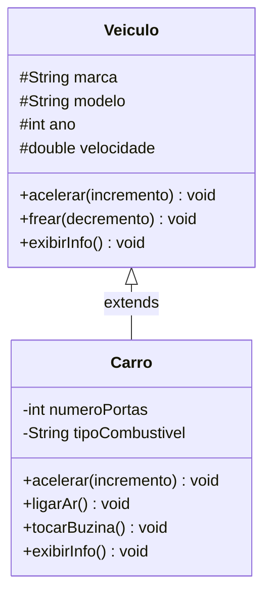

# Módulo 05 — Herança

Você vai perceber que várias classes suas repetem atributos e métodos parecidos. A herança é a ferramenta da POO para escrever o comum **uma vez só** e deixar cada classe filha adicionar apenas o que tem de especial.

## Objetivos de aprendizagem

Ao final deste módulo você será capaz de:

- [ ] Criar uma hierarquia com `extends`
- [ ] Chamar o construtor da classe mãe com `super(...)`
- [ ] Sobrescrever métodos com `@Override` e reaproveitar a versão da mãe com `super.metodo()`
- [ ] Decidir entre `private` e `protected` para atributos da classe mãe
- [ ] Explicar a relação "é um" (um Carro É UM Veículo)

## Pré-requisitos

[Módulo 04](../modulo-04-colecoes-e-menus/) concluído.

## Conceito

### A relação "é um"

Herança modela relações do tipo "é um": um carro **é um** veículo, uma moto **é um** veículo. O que todo veículo tem (marca, modelo, acelerar, frear) mora na classe mãe; o que só o carro tem (portas, buzina) mora na filha.



O `#` no diagrama indica `protected`: visível para a própria classe **e para as filhas**. É o meio-termo entre `private` (nem as filhas veem) e `public` (todo mundo vê).

Teste antes de usar herança: diga a frase em voz alta. "Carro é um Veículo" soa bem. "Motor é um Carro" soa errado — motor é PARTE de um carro (isso é composição: o carro TEM UM motor como atributo).

### super: falando com a classe mãe

Duas formas, dois usos:

```java
public Carro(String marca, String modelo, int ano, int portas, String combustivel) {
    super(marca, modelo, ano);   // 1) executa o construtor de Veiculo PRIMEIRO
    this.numeroPortas = portas;
    this.tipoCombustivel = combustivel;
}

@Override
public void exibirInfo() {
    super.exibirInfo();          // 2) reaproveita a versao da mae...
    System.out.println("Portas: " + numeroPortas);   // ...e complementa
}
```

O padrão "chama `super.metodo()` e acrescenta" é extremamente comum: a filha não reescreve o trabalho da mãe, só o estende.

### @Override: o cinto de segurança

A anotação `@Override` pede ao compilador: "confira que estou mesmo sobrescrevendo algo". Sem ela, um erro de digitação (`exibirinfo` com "i" minúsculo) criaria silenciosamente um método NOVO, e a versão da mãe continuaria sendo chamada. Com ela, o compilador acusa na hora. Use sempre.

## Exemplo guiado

- [model/Veiculo.java](exemplo/model/Veiculo.java) — a classe mãe.
- [model/Carro.java](exemplo/model/Carro.java) — herda, sobrescreve `acelerar` e `exibirInfo`, adiciona `ligarAr` e `tocarBuzina`.
- [app/TesteHeranca.java](exemplo/app/TesteHeranca.java) — exercita tudo.

```bash
cd exemplo
javac -d bin model/*.java app/*.java
java -cp bin app.TesteHeranca
```

Experimentos que valem a pena:

1. Comente o `super(marca, modelo, ano)` no construtor de `Carro` e compile. Leia o erro: o Java EXIGE que a mãe seja construída.
2. Remova o `@Override` de `acelerar` e renomeie para `acellerar`. Compila? Sim. Funciona como esperado? Não. Recoloque o `@Override` e veja o compilador salvar você.
3. Crie uma classe `Moto` estendendo `Veiculo` com um método `empinar()` — cinco minutos, e é o aquecimento do exercício 1.

## Exercícios

1. [EXERCICIO-01-moto.md](exercicios/EXERCICIO-01-moto.md) — fixação: mais uma filha para `Veiculo`.
2. [EXERCICIO-02-rpg.md](exercicios/EXERCICIO-02-rpg.md) — aplicação: hierarquia de personagens de RPG com sobrescritas.

## Auto-avaliação

- [ ] Sei explicar a diferença entre "é um" (herança) e "tem um" (composição)
- [ ] Sei o que acontece se a filha não chamar `super(...)` no construtor
- [ ] Usei `super.metodo()` para estender um comportamento sem reescrevê-lo
- [ ] Sei justificar por que `@Override` deve ser usado sempre

## Erros comuns

| Erro | O que está acontecendo |
| --- | --- |
| `constructor Veiculo in class Veiculo cannot be applied...` | O construtor da filha não chamou `super(...)` e a mãe não tem construtor vazio |
| Sobrescrita "não funciona" | Assinatura diferente da original (nome ou parâmetros) — sem `@Override` o compilador não avisa |
| Filha não enxerga atributo da mãe | O atributo é `private`; mude para `protected` ou use o getter |
| Herdar só para reaproveitar um método útil | Se a frase "X é um Y" não faz sentido, herança é a ferramenta errada |

---

Anterior: [Módulo 04](../modulo-04-colecoes-e-menus/) | Próximo: [Módulo 06 — Abstração e polimorfismo](../modulo-06-abstracao-e-polimorfismo/)
