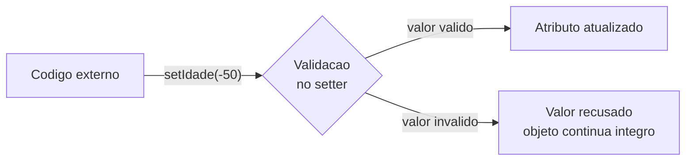

# Módulo 05 — Validação e integridade

No módulo anterior seus objetos já protegiam os atributos com `private` e getters/setters. Mas os setters só organizavam o acesso — não recusavam nada. Agora eles aprendem a **se proteger de verdade**: ninguém mais vai conseguir colocar uma idade de -50 anos numa `Pessoa`.

## Objetivos de aprendizagem

Ao final deste módulo você será capaz de:

- [ ] Escrever setters que validam antes de aceitar um valor
- [ ] Fazer o construtor validar também, delegando para os setters
- [ ] Explicar por que um objeto nunca deve nascer num estado inválido

## Pré-requisitos

[Módulo 04](../modulo-04-encapsulamento/) concluído.

## Conceito

### A receita da validação

1. Atributos `private`, getters, setters — isso já está pronto desde o módulo 04.
2. O setter passa a **recusar** valores fora da regra, em vez de só atribuir:

```java
public void setIdade(int idade) {
    if (idade < 0 || idade > 150) {
        System.out.println("Erro: idade invalida: " + idade);
        return;              // recusa o valor, o atributo nao muda
    }
    this.idade = idade;
}
```



Regra de ouro: **não existe caminho para o atributo que passe por fora da validação**. É isso que garante que o objeto nunca fica num estado inválido.

### O construtor também precisa validar

Se só o setter validasse, o construtor ainda poderia criar um objeto com dados inválidos direto — a validação viraria decoração. A solução: o construtor **não atribui os atributos diretamente**, ele chama os próprios setters:

```java
public Pessoa(String nome, int idade, double altura) {
    this.nome = "Sem nome";   // valores seguros de partida
    this.idade = 0;
    this.altura = 1.70;

    setNome(nome);            // se for recusado, o valor seguro permanece
    setIdade(idade);
    setAltura(altura);
}
```

Assim a regra existe **num lugar só** (dentro de cada setter) e vale tanto para quem cria o objeto quanto para quem o modifica depois.

## Exemplo guiado

- [model/Pessoa.java](exemplo/model/Pessoa.java) — a Pessoa do módulo 04, agora com setters que validam e um construtor que delega para eles.
- [app/TesteValidacoes.java](exemplo/app/TesteValidacoes.java) — ataca o objeto diretamente, tentando quebrá-lo de várias formas.

```bash
cd exemplo
javac -d bin model/*.java app/*.java
java -cp bin app.TesteValidacoes
```

Leia a saída com atenção: toda vez que um valor inválido é recusado, o objeto continua com o último valor válido. Nada quebra silenciosamente.

## Exercícios

1. [EXERCICIO-01-conta-de-jogador.md](exercicios/EXERCICIO-01-conta-de-jogador.md) — construa uma classe blindada por validações.

> Este módulo ainda vai ganhar mais exercícios (aplicação e desafio) numa próxima revisão do material.

## Auto-avaliação

- [ ] Meus setters recusam valores inválidos (testei com valores absurdos)
- [ ] Entendi por que o construtor também deve validar (chamando os setters)
- [ ] Sei explicar por que a regra de validação deve existir num lugar só

## Erros comuns

| Erro | O que está acontecendo |
| --- | --- |
| Validar no setter mas não no construtor | O objeto nasce inválido; a validação vira decoração |
| Setter que imprime erro mas atribui mesmo assim | Faltou o `return` após detectar o valor inválido |
| Construtor atribuindo direto (`this.idade = idade;`) em vez de chamar `setIdade(idade)` | Reintroduz o mesmo buraco que o setter tentou fechar |

---

Anterior: [Módulo 04](../modulo-04-encapsulamento/) | Próximo: [Módulo 06 — static e classes utilitárias](../modulo-06-static-e-classes-utilitarias/)
