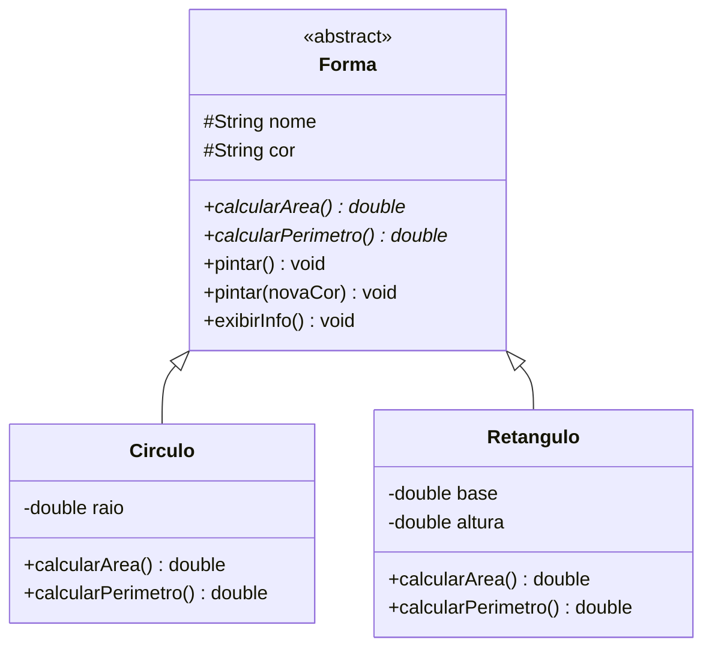

# Módulo 06 — Abstração e polimorfismo

Este é o módulo mais denso do curso — e o mais recompensador. Aqui a herança do módulo 05 ganha superpoderes: classes que não podem ser instanciadas, métodos sem corpo que obrigam as filhas a trabalhar, e uma única linha de código que se comporta diferente para cada tipo de objeto.

## Objetivos de aprendizagem

Ao final deste módulo você será capaz de:

- [ ] Criar classes abstratas e métodos abstratos, e explicar quando usá-los
- [ ] Diferenciar sobrecarga (overload) de sobrescrita (override) sem hesitar
- [ ] Usar polimorfismo: tratar uma lista de tipos diferentes pelo tipo comum
- [ ] Explicar como o Java decide QUAL versão do método executar

## Pré-requisitos

[Módulo 05](../modulo-05-heranca/) concluído, exercício do RPG feito.

## Conceito

### Classe abstrata: o molde que não fabrica sozinho

Pergunta: o que é "uma forma geométrica" de área...? Área de quê? A pergunta não faz sentido sem saber SE é círculo ou retângulo. `Forma` é um conceito, não uma coisa completa — e o Java tem um recurso exatamente para isso:

```java
public abstract class Forma {
    public abstract double calcularArea();   // sem corpo: cada filha implementa
}
```

- `new Forma(...)` não compila. Só as filhas concretas podem ser instanciadas.
- Todo método `abstract` é uma obrigação: `Circulo` e `Retangulo` DEVEM implementar `calcularArea()`, senão nem compilam.
- A classe abstrata ainda pode ter métodos normais com corpo (como `exibirInfo()`), que as filhas herdam prontos.



Aqui os dois lados da **abstração** se encontram: além de "modelar só o que importa" (módulo 01), abstrair também é **programar contra o conceito geral** (`Forma`) sem depender dos detalhes de cada caso (`Circulo`, `Retangulo`).

### Sobrecarga × sobrescrita: pare e grave

A dupla que mais cai em prova e mais confunde:

| | Sobrecarga (Overload) | Sobrescrita (Override) |
| --- | --- | --- |
| Onde | Mesma classe | Entre mãe e filha |
| Assinatura | MESMO nome, parâmetros DIFERENTES | Nome E parâmetros idênticos |
| Decidida | Em compilação (pelo que você passa) | Em execução (pelo objeto real) |
| Exemplo | `pintar()` e `pintar(String cor)` | `calcularArea()` em cada forma |

### Polimorfismo: a recompensa

Junte tudo e olhe para este código:

```java
List<Forma> formas = new ArrayList<>();
formas.add(new Circulo("C1", "Azul", 2.0));
formas.add(new Retangulo("R1", "Verde", 3.0, 4.0));

for (Forma f : formas) {
    System.out.println(f.calcularArea());   // <- a linha magica
}
```

A MESMA linha `f.calcularArea()` executa a fórmula do círculo na primeira volta e a do retângulo na segunda. O Java olha o objeto REAL (não o tipo da variável) na hora de executar — isso se chama *ligação dinâmica*.

O ganho prático: amanhã alguém cria `Triangulo extends Forma` e este `for` continua funcionando **sem mudar uma linha**. Código que aceita extensão sem precisar de modificação é o que separa sistemas fáceis de manter dos difíceis.

## Exemplos guiados (dois!)

### 1. Formas geométricas — o essencial em miniatura

Em [exemplo-formas/](exemplo-formas/): `Forma` abstrata, `Circulo`, `Retangulo` e um teste com polimorfismo e sobrecarga (`pintar`).

```bash
cd exemplo-formas
javac -d bin model/*.java app/*.java
java -cp bin app.TesteFormas
```

### 2. Sistema acadêmico — os conceitos em um sistema real

Em [exemplo-sistema-academico/](exemplo-sistema-academico/): `Pessoa` abstrata, `Aluno` e `Professor` concretos, menu completo com listas — os módulos 03 e 04 reaparecem por aqui.

```bash
cd exemplo-sistema-academico
javac -d bin model/*.java util/*.java app/*.java
java -cp bin app.App
```

Comece pelas formas (conceito puro), depois estude o acadêmico (conceito aplicado).

## Exercícios

1. [EXERCICIO-01-funcionarios.md](exercicios/EXERCICIO-01-funcionarios.md) — o grande exercício de sobrecarga + sobrescrita + polimorfismo, com folha de pagamento.

## Auto-avaliação

- [ ] Sei explicar por que `new Forma(...)` não deve existir
- [ ] Diferencio sobrecarga de sobrescrita em qualquer código que me mostrarem
- [ ] Sei prever qual versão do método roda em `Forma f = new Circulo(...); f.exibirInfo();`
- [ ] Sei explicar o que ganho ao programar "contra a abstração" (`List<Forma>` e não `List<Circulo>`)

## Erros comuns

| Erro | O que está acontecendo |
| --- | --- |
| `Forma is abstract; cannot be instantiated` | Tentou `new Forma(...)` — instancie uma filha concreta |
| `... is not abstract and does not override abstract method...` | A filha esqueceu de implementar um método abstrato |
| Achar que `f.calcularArea()` usa a versão de `Forma` | O tipo da VARIÁVEL não decide; o objeto criado no `new` decide |
| Sobrecarregar mudando só o nome do parâmetro | Sobrecarga exige TIPOS ou QUANTIDADE diferentes, não nomes |

---

Anterior: [Módulo 05](../modulo-05-heranca/) | Próximo: [Módulo 07 — Interfaces](../modulo-07-interfaces/)
