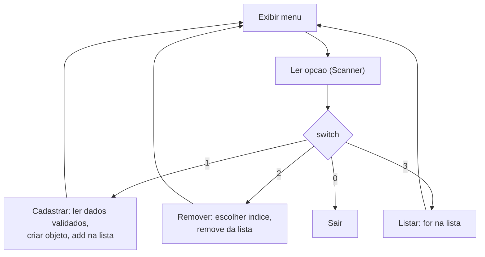

# Módulo 08 — Scanner e menus interativos

Com listas dominadas, falta o último pedaço para um sistema de console de verdade: ler o que o usuário digita e montar um menu que repete até ele sair. Neste módulo você constrói seu primeiro sistema completo — uma academia.

## Objetivos de aprendizagem

Ao final deste módulo você será capaz de:

- [ ] Ler dados do usuário com `Scanner`, com validação
- [ ] Montar um menu interativo com laço e `switch`
- [ ] Implementar as operações de um CRUD em memória (criar, listar, remover)

## Pré-requisitos

[Módulo 07](../modulo-07-colecoes/) concluído — as listas de lá serão usadas aqui o tempo todo.

## Conceito

### A anatomia de um sistema de console

Quase todo sistema interativo dos próximos módulos segue este esqueleto:



Memorize esse desenho: ele se repete no sistema bancário e provavelmente no seu projeto final.

### Scanner: cuidado com nextInt() e nextLine()

`scanner.nextInt()` lê o número mas deixa o Enter no buffer — a próxima chamada a `nextLine()` lê essa sobra vazia, não o que o usuário digitaria a seguir. Por isso, no exemplo, toda leitura passa por `scanner.nextLine()` e depois `Integer.parseInt(...)` — mais simples de controlar.

> **Cheiro de código** — a partir daqui seus programas ficam grandes o bastante para você começar a
> se repetir. Toda vez que copiar um bloco e trocar um detalhe (o mesmo `if` de validação em três
> opções do menu, o mesmo `for` de listagem em dois lugares), anote mentalmente: isso tem nome,
> chama-se **duplicação**, e é o assunto do [módulo 15](../modulo-15-refatoracao/). Não precisa
> resolver agora — precisa começar a enxergar.

## Exemplo guiado: Sistema Academia

- [model/Aluno.java](exemplo/model/Aluno.java) — nome, idade e plano (1 = Básico, 2 = Premium).
- [model/Treino.java](exemplo/model/Treino.java) — exercício, séries, repetições e carga.
- [util/Validacoes.java](exemplo/util/Validacoes.java) — leitura validada de strings e inteiros com faixa (min/max).
- [app/Main.java](exemplo/app/Main.java) — o menu que amarra tudo.

```bash
cd exemplo
javac -d bin model/*.java util/*.java app/*.java
java -cp bin app.Main
```

Pontos para observar na leitura do `Main`:

1. As listas (`alunos`, `treinos`) são o "banco de dados" do sistema — tudo em memória, some ao fechar. Persistência em arquivo/banco é assunto para outra disciplina; aqui o foco é o modelo.
2. Nenhum dado entra num objeto sem passar por `Validacoes`.
3. Cada opção do menu virou um método próprio (`cadastrarAluno()`, `listarAlunos()`...). Compare mentalmente com o que seria um `main` de 200 linhas.

## Exercícios

1. [EXERCICIO-01-agenda-de-contatos.md](exercicios/EXERCICIO-01-agenda-de-contatos.md) — seu primeiro CRUD completo, sozinho.

> Este módulo ainda vai ganhar mais exercícios (fixação e desafio) numa próxima revisão do material.

## Auto-avaliação

- [ ] Sei ler um inteiro do teclado sem o programa explodir se o usuário digitar texto
- [ ] Entendo por que remover item de uma lista durante um for-each dá problema
- [ ] Construí um menu com laço + `switch` do zero

## Erros comuns

| Erro | O que está acontecendo |
| --- | --- |
| `InputMismatchException` ao digitar texto onde se espera número | Falta tratar a entrada — veja como `Validacoes` resolve |
| `nextInt()` seguido de `nextLine()` lendo string vazia | O Enter fica no buffer do Scanner; prefira sempre `nextLine()` + conversão manual |
| `IndexOutOfBoundsException` ao remover | Índice digitado pelo usuário fora do tamanho da lista — valide contra `lista.size()` |
| Modificar a lista dentro do for-each | `ConcurrentModificationException` — remova por índice fora do laço |

---

Anterior: [Módulo 07](../modulo-07-colecoes/) | Próximo: [Módulo 09 — Igualdade de objetos](../modulo-09-igualdade-de-objetos/)
