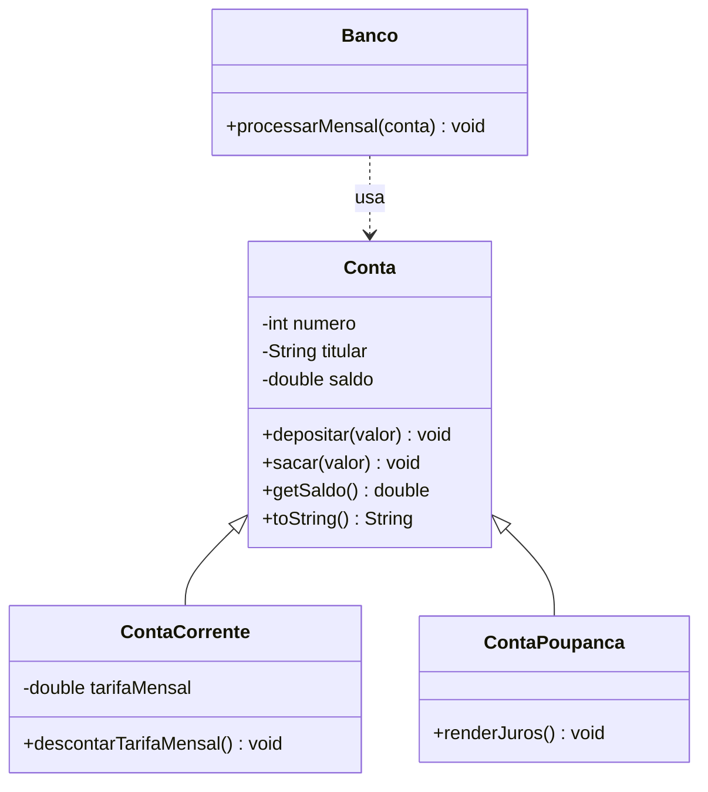

# Módulo 10 — Estudo de caso: sistema bancário

Chegou a hora de ver todos os conceitos do curso trabalhando juntos em um sistema clássico: um banco com tipos diferentes de conta. Este módulo é menos sobre conceito novo e mais sobre **leitura crítica**: você vai estudar o sistema, entender as decisões de projeto e depois melhorá-lo nos exercícios.

## Objetivos de aprendizagem

Ao final deste módulo você será capaz de:

- [ ] Ler um sistema orientado a objetos completo e explicar o papel de cada classe
- [ ] Reconhecer os conceitos dos módulos anteriores aplicados em conjunto
- [ ] Criticar decisões de projeto e propor melhorias fundamentadas
- [ ] Estender um sistema existente sem quebrar o que já funciona

## Pré-requisitos

Módulos 02 a 09 concluídos. Este módulo usa todos.

## O sistema



- [model/Conta.java](exemplo/model/Conta.java) — a base: saldo encapsulado, depósito e saque com proteções.
- [model/ContaCorrente.java](exemplo/model/ContaCorrente.java) — especializa com tarifa mensal.
- [model/ContaPoupanca.java](exemplo/model/ContaPoupanca.java) — especializa com rendimento de juros.
- [model/Banco.java](exemplo/model/Banco.java) — processa o fechamento mensal de qualquer conta.
- [app/Main.java](exemplo/app/Main.java) — menu interativo de operações.

```bash
cd exemplo
javac -d bin model/*.java util/*.java app/*.java
java -cp bin app.Main
```

## Roteiro de estudo guiado

Siga nesta ordem, com o código aberto:

### 1. Conta: o encapsulamento protegendo dinheiro

Repare que `saldo` é `private` e que `sacar` só executa se `valor > 0 && valor <= saldo`. Nenhum código externo consegue deixar o saldo negativo — a integridade mora DENTRO da classe (módulo 03 em ação).

### 2. As filhas: herança com propósito

`ContaCorrente` e `ContaPoupanca` não repetem nada de `Conta`: herdam tudo e adicionam apenas sua especialidade. Repare como `renderJuros()` usa `getSaldo()` e `depositar()` — a filha respeita o encapsulamento da mãe em vez de mexer direto no saldo (módulos 03 e 05 juntos).

### 3. Banco: um ponto para discussão

Olhe o `processarMensal` do `Banco`:

```java
if (conta instanceof ContaCorrente cc) {
    cc.descontarTarifaMensal();
} else if (conta instanceof ContaPoupanca cp) {
    cp.renderJuros();
}
```

Funciona — mas depois do módulo 06, esse `instanceof` em cadeia deveria incomodar você. Se amanhã surgir uma `ContaSalario`, alguém PRECISA lembrar de alterar o `Banco`. Compare com o `for` de formas do módulo 06, que aceitava novas filhas sem mudar. Pergunta para a aula: **como o polimorfismo eliminaria esses `instanceof`?**

<details>
<summary>Pense antes de abrir a resposta</summary>

Criando um método comum — por exemplo, um abstrato `processarFimDeMes()` em `Conta` — que cada filha implementa do seu jeito (a corrente desconta tarifa, a poupança rende juros). O `Banco` viraria uma linha: `conta.processarFimDeMes();`. Essa melhoria é exatamente o exercício 1.

</details>

### 4. O silêncio do sacar

`sacar(5000)` numa conta com R$ 100 simplesmente... não faz nada. Depois do módulo 08 você sabe que isso é um problema — e sabe a ferramenta certa. É o exercício 2.

## Exercícios

Os dois exercícios transformam as críticas do roteiro em trabalho prático:

1. [EXERCICIO-01-polimorfismo-no-banco.md](exercicios/EXERCICIO-01-polimorfismo-no-banco.md) — elimine os `instanceof` com um método polimórfico.
2. [EXERCICIO-02-excecoes-no-banco.md](exercicios/EXERCICIO-02-excecoes-no-banco.md) — acabe com as falhas silenciosas usando exceções personalizadas.

## Auto-avaliação

- [ ] Sei explicar o papel de cada uma das 5 classes sem olhar o código
- [ ] Sei apontar onde estão encapsulamento, herança e validação no sistema
- [ ] Entendi por que o `instanceof` em cadeia é um sinal de alerta
- [ ] Fiz os dois exercícios e o sistema continuou funcionando

## Erros comuns nesta fase

| Erro | O que está acontecendo |
| --- | --- |
| Estender o sistema alterando a classe mãe para cada caso novo | Prefira adicionar filhas; a mãe deve ficar estável |
| Filha acessando `saldo` diretamente | `saldo` é `private` de propósito: use `depositar`/`sacar`/`getSaldo` |
| Resolver o exercício 1 mantendo os `instanceof` "só por garantia" | O objetivo é exatamente removê-los; confie no polimorfismo |

---

Anterior: [Módulo 09](../modulo-09-refatoracao/) | Próximo: [Módulo 11 — Projeto integrador](../modulo-11-projeto-integrador/)
