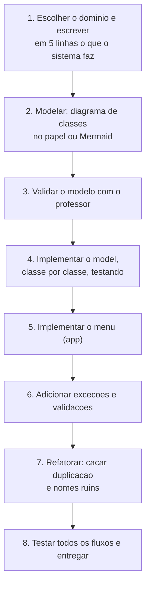

# Módulo 11 — Projeto integrador

Todos os módulos anteriores foram treino. Agora é o jogo: você vai projetar e construir um sistema completo, do zero, aplicando tudo o que aprendeu. Este é o trabalho final da disciplina.

## O desafio

Construa um sistema de console para gerenciar um domínio à sua escolha. Sugestões (ou proponha o seu ao professor):

- Locadora de veículos ou de jogos
- Clínica veterinária
- Oficina mecânica
- Lanchonete / delivery
- Biblioteca ou livraria
- Loja de eletrônicos

O domínio é livre; os requisitos técnicos, não.

## Requisitos obrigatórios

Seu sistema deve conter, no mínimo:

| # | Requisito | Módulo relacionado |
| --- | --- | --- |
| 1 | Pelo menos 4 classes de domínio no pacote `model` | 02 |
| 2 | Todos os atributos privados, com validação nos setters ou construtor | 03 |
| 3 | Menu interativo com `Scanner` e CRUD de pelo menos uma entidade (`ArrayList`) | 04 |
| 4 | Uma hierarquia de herança com classe abstrata e pelo menos 2 filhas concretas | 05, 06 |
| 5 | Pelo menos um uso REAL de polimorfismo (laço sobre o tipo abstrato ou interface) | 06, 07 |
| 6 | Pelo menos 1 interface implementada por classes de árvores diferentes | 07 |
| 7 | Pelo menos 1 exceção personalizada no pacote `exception`, lançada e tratada | 08 |
| 8 | Pacotes organizados: `model`, `app`, `util` (se precisar) e `exception` | todos |
| 9 | Nenhum código duplicado evidente (aplique o módulo 09 antes de entregar) | 09 |

Atenção ao requisito 5: "uso real" significa que o polimorfismo resolve um problema do seu sistema (ex.: calcular o preço de itens diferentes num mesmo laço), não um trecho decorativo para marcar o item.

## Um exemplo de escopo: o Sistema de Estoque

Em [exemplo-referencia/](exemplo-referencia/) você encontra um sistema de estoque completo (produtos com cadastro, busca, atualização e remoção). Ele mostra o TAMANHO esperado de um projeto — nem trivial, nem gigante.

Importante: ele foi escrito antes dos módulos finais e **não atende a todos os requisitos** da tabela (não tem herança, interface nem exceções personalizadas). Um bom exercício preparatório é identificar exatamente quais requisitos ele descumpre — e como você os atenderia.

```bash
cd exemplo-referencia
javac -d bin model/*.java app/*.java
java -cp bin app.Main
```

## Roteiro sugerido de desenvolvimento

Não comece pelo código. Siga as fases:



Dica de quem já corrigiu muitos projetos: a fase 2 malfeita é a principal causa de projeto refeito na última semana. Um diagrama de 20 minutos economiza dias.

## Entrega

- Repositório (ou pasta) com a estrutura de pacotes do curso.
- Um `README.md` do SEU projeto contendo: o que o sistema faz, o diagrama de classes (Mermaid) e onde está cada requisito da tabela (ex.: "Req. 7: `exception/EstoqueVazioException.java`, tratada em `app/Main.java`").
- Data e formato de entrega: definidos em aula.

## Avaliação

A correção segue a [rubrica de avaliação](../material-apoio/rubrica-avaliacao.md) — leia antes de começar e use como checklist final. Em resumo: funcionar é o mínimo; a qualidade do MODELO (classes coerentes, responsabilidades bem distribuídas) é o que diferencia as notas altas.

---

Anterior: [Módulo 10](../modulo-10-estudo-de-caso-banco/) | Fim da trilha — parabéns por chegar aqui.
