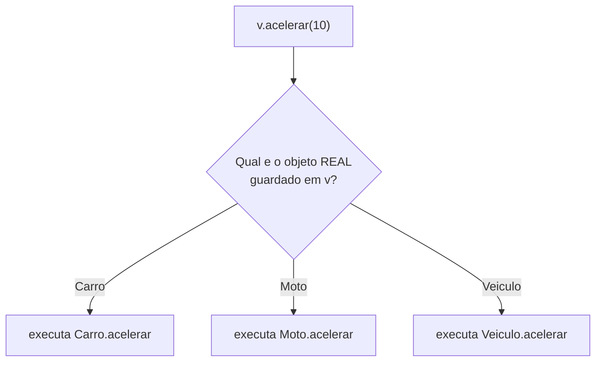

# Módulo 11 — Sobrescrita e polimorfismo

No módulo de herança você já usou `@Override` na prática. Agora vem a recompensa: quando várias classes filhas sobrescrevem o mesmo método, uma única linha de código passa a se comportar diferente para cada tipo de objeto.

## Objetivos de aprendizagem

Ao final deste módulo você será capaz de:

- [ ] Diferenciar sobrecarga (overload) de sobrescrita (override) sem hesitar
- [ ] Usar polimorfismo: tratar uma lista de tipos diferentes pelo tipo comum
- [ ] Explicar como o Java decide QUAL versão do método executar, em tempo de execução

## Pré-requisitos

[Módulo 10](../modulo-10-heranca/) concluído — você já sabe `extends`, `super` e `@Override`.

## Conceito

### Sobrecarga × sobrescrita: pare e grave

Você viu sobrecarga no [módulo 03](../modulo-03-construtores-e-sobrecarga/) e sobrescrita no módulo 10. Agora que os dois já existem em código, compare lado a lado:

| | Sobrecarga (Overload) | Sobrescrita (Override) |
| --- | --- | --- |
| Onde | Mesma classe | Entre mãe e filha |
| Assinatura | MESMO nome, parâmetros DIFERENTES | Nome E parâmetros idênticos |
| Decidida | Em compilação (pelo que você passa) | Em execução (pelo objeto real) |
| Exemplo | `buzinar()` e `buzinar(int vezes)` | `acelerar(double)` em cada `Veiculo` |

### Polimorfismo: a recompensa

Junte tudo e olhe para este código:

```java
List<Veiculo> veiculos = new ArrayList<>();
veiculos.add(new Carro("Toyota", "Corolla", 2022, 4));
veiculos.add(new Moto("Honda", "CG", 2021, true));

for (Veiculo v : veiculos) {
    v.acelerar(10);   // <- a linha magica
}
```

A MESMA linha `v.acelerar(10)` executa a versão de `Carro` na primeira volta e a de `Moto` na segunda. O Java olha o objeto REAL (não o tipo da variável) na hora de executar — isso se chama **ligação dinâmica**.

O ganho prático: amanhã alguém cria `Caminhao extends Veiculo` e este `for` continua funcionando **sem mudar uma linha**. Código que aceita extensão sem precisar de modificação é o que separa sistemas fáceis de manter dos difíceis.



> **Cheiro de código** — o oposto dessa linha mágica é a escada de `if`:
> `if (v instanceof Carro) { ... } else if (v instanceof Moto) { ... }`.
> Ela funciona, mas cresce a cada tipo novo e obriga a mexer em código que já estava pronto.
> Sempre que escrever uma dessas, pergunte: "isso não deveria ser um método sobrescrito?".
> Trocar escada de `if` por polimorfismo é uma das refatorações do
> [módulo 15](../modulo-15-refatoracao/).

## Exemplo guiado

- [model/Veiculo.java](exemplo/model/Veiculo.java) — agora com `buzinar()` sobrecarregado (revisão do módulo 03).
- [model/Carro.java](exemplo/model/Carro.java) e [model/Moto.java](exemplo/model/Moto.java) — duas filhas, cada uma sobrescrevendo `acelerar` e `exibirInfo` do seu próprio jeito.
- [app/TestePolimorfismo.java](exemplo/app/TestePolimorfismo.java) — uma `List<Veiculo>` misturando `Carro` e `Moto`.

```bash
cd exemplo
javac -d bin model/*.java app/*.java
java -cp bin app.TestePolimorfismo
```

Experimente: crie uma terceira classe filha de `Veiculo` (ex.: `Caminhao`), adicione-a na lista do teste e comprove que o `for` não precisou mudar.

## Exercícios

1. [EXERCICIO-01-animais.md](exercicios/EXERCICIO-01-animais.md) — sobrescrita e polimorfismo com uma hierarquia de animais.

> Este módulo ainda vai ganhar mais exercícios (fixação e desafio) numa próxima revisão do material.

## Auto-avaliação

- [ ] Diferencio sobrecarga de sobrescrita em qualquer código que me mostrarem
- [ ] Sei prever qual versão do método roda em `Veiculo v = new Moto(...); v.acelerar(10);`
- [ ] Escrevi um `for` que percorre uma lista de tipos diferentes pelo tipo comum

## Erros comuns

| Erro | O que está acontecendo |
| --- | --- |
| Achar que `v.acelerar(10)` usa a versão de `Veiculo` | O tipo da VARIÁVEL não decide; o objeto criado no `new` decide |
| Sobrecarregar mudando só o nome do parâmetro | Sobrecarga exige TIPOS ou QUANTIDADE diferentes, não nomes |
| Confundir os dois termos numa prova/entrevista | Sobrecarga = mesma classe; sobrescrita = mãe e filha |

---

Anterior: [Módulo 10](../modulo-10-heranca/) | Próximo: [Módulo 12 — Abstração](../modulo-12-abstracao/)
