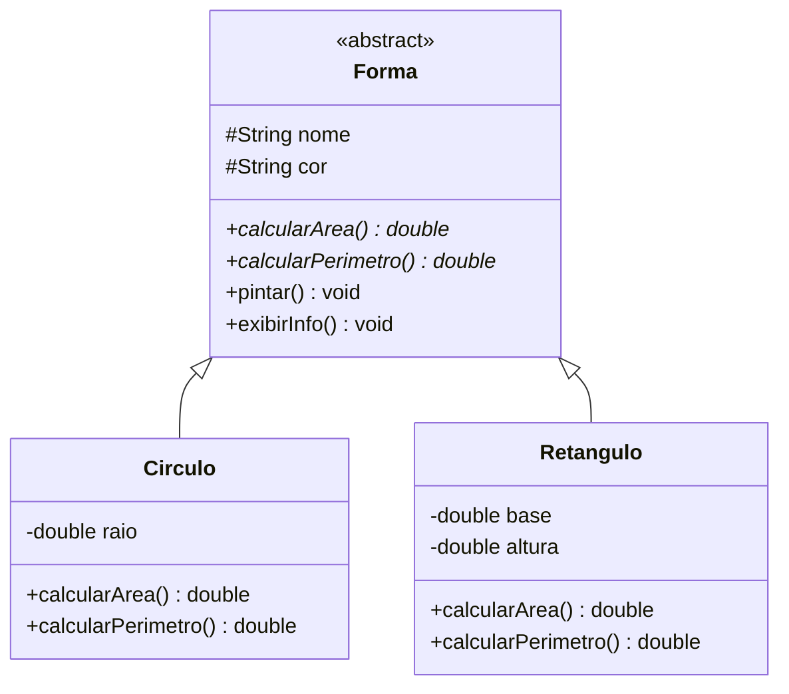

# Módulo 12 — Abstração

Pergunta: o que é "uma forma geométrica" de área...? Área de quê? A pergunta não faz sentido sem saber SE é círculo ou retângulo. `Forma` é um conceito, não uma coisa completa, e o Java tem um recurso exatamente para isso: classes e métodos abstratos.

## Objetivos de aprendizagem

Ao final deste módulo você será capaz de:

- [ ] Criar classes abstratas e métodos abstratos, e explicar quando usá-los
- [ ] Explicar por que `new` numa classe abstrata não compila
- [ ] Programar contra o tipo abstrato (`List<Forma>`) em vez do tipo concreto

## Pré-requisitos

[Módulo 11](../modulo-11-sobrescrita-e-polimorfismo/) concluído.

## Conceito

### Classe abstrata: o molde que não fabrica sozinho

```java
public abstract class Forma {
    public abstract double calcularArea();   // sem corpo: cada filha implementa
}
```

- `new Forma(...)` não compila. Só as filhas concretas podem ser instanciadas.
- Todo método `abstract` é uma obrigação: `Circulo` e `Retangulo` DEVEM implementar `calcularArea()`, senão nem compilam.
- A classe abstrata ainda pode ter métodos normais com corpo (como `exibirInfo()`), que as filhas herdam prontos.



### Por que não deixar Forma concreta, com calcularArea() retornando 0?

Você poderia escrever uma `Forma` normal, com `calcularArea()` retornando `0` por padrão, e deixar cada filha sobrescrever se quiser. O problema é que, se uma filha nova **esquecer** de sobrescrever, o programa compila e roda, só que devolve uma área errada, silenciosamente. Com `abstract`, esse erro vira um erro de **compilação**, pego antes de qualquer execução. Errar cedo é sempre mais barato.

### Abstração, de novo (agora com código)

Você já viu "abstrair é decidir o que entra no modelo" no [módulo 01](../modulo-01-por-que-poo/). Aqui os dois lados se encontram: além de modelar só o que importa, abstrair também é **programar contra o conceito geral** (`Forma`) sem depender dos detalhes de cada caso (`Circulo`, `Retangulo`). Uma `List<Forma>` aceita qualquer forma futura sem precisar saber, hoje, quais formas vão existir.

## Exemplo guiado

- [model/Forma.java](exemplo/model/Forma.java): abstrata, com dois métodos abstratos e dois concretos.
- [model/Circulo.java](exemplo/model/Circulo.java) e [model/Retangulo.java](exemplo/model/Retangulo.java): implementam os métodos abstratos, cada uma com sua fórmula.
- [app/TesteFormas.java](exemplo/app/TesteFormas.java): array de `Forma` misturando os dois tipos.

```bash
cd exemplo
javac -d bin model/*.java app/*.java
java -cp bin app.TesteFormas
```

Experimente: tente `new Forma("X", "Azul")` em algum lugar do teste. Leia a mensagem de erro do compilador.

## Exercícios

1. [EXERCICIO-01-funcionarios.md](exercicios/EXERCICIO-01-funcionarios.md): o grande exercício final do bloco, com classe abstrata, sobrecarga, sobrescrita e polimorfismo juntos, numa folha de pagamento.

## Auto-avaliação

- [ ] Sei explicar por que `new Forma(...)` não deve existir
- [ ] Sei explicar o que ganho ao programar "contra a abstração" (`List<Forma>` e não `List<Circulo>`)
- [ ] Sei por que um método abstrato é mais seguro que um método concreto com um valor padrão "bobo"

## Erros comuns

| Erro | O que está acontecendo |
| --- | --- |
| `Forma is abstract; cannot be instantiated` | Tentou `new Forma(...)`. Instancie uma filha concreta |
| `... is not abstract and does not override abstract method...` | A filha esqueceu de implementar um método abstrato |
| Achar que uma classe abstrata não pode ter métodos com corpo | Pode: só os métodos marcados `abstract` ficam sem corpo |

---

Anterior: [Módulo 11](../modulo-11-sobrescrita-e-polimorfismo/) | Próximo: [Módulo 13 — Interfaces](../modulo-13-interfaces/)
