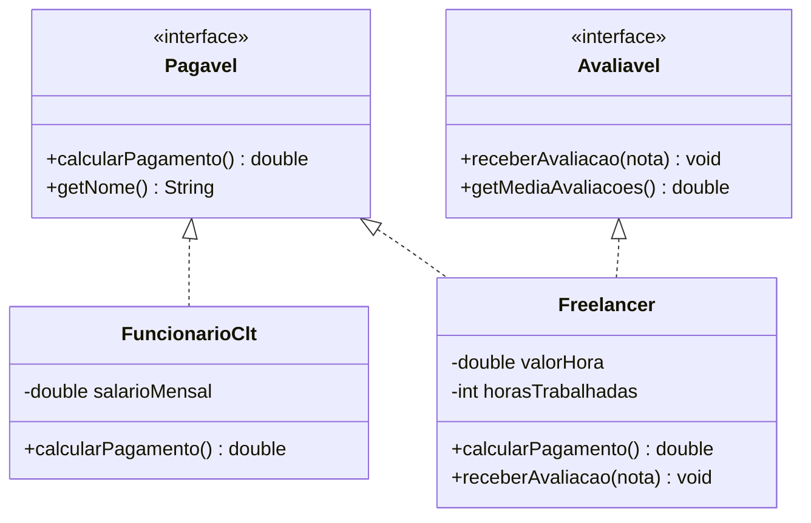

# Módulo 13 — Interfaces

A classe abstrata do módulo anterior tem uma limitação: cada classe só pode estender UMA mãe. E quando dois tipos completamente diferentes, sem parentesco nenhum, precisam ser tratados do mesmo jeito? A resposta é a interface: um contrato puro.

## Objetivos de aprendizagem

Ao final deste módulo você será capaz de:

- [ ] Declarar uma interface e implementá-la com `implements`
- [ ] Implementar múltiplas interfaces em uma mesma classe
- [ ] Usar polimorfismo por interface (`List<Pagavel>`)
- [ ] Decidir com critério entre classe abstrata e interface

## Pré-requisitos

[Módulo 12](../modulo-12-abstracao/) concluído. Interfaces são o segundo capítulo da história do polimorfismo.

## Conceito

### O contrato

Uma interface só declara O QUE deve existir, nunca COMO:

```java
public interface Pagavel {
    double calcularPagamento();   // public e abstract por padrao
    String getNome();
}
```

Quem assina o contrato se compromete com tudo:

```java
public class FuncionarioClt implements Pagavel {
    // e OBRIGADO a implementar calcularPagamento() e getNome()
}
```

### O problema que a interface resolve

Pense num sistema de pagamentos. Um funcionário CLT recebe salário fixo; um freelancer recebe por hora. As classes não têm parentesco, e forçar uma herança comum (`Trabalhador`?) seria artificial. Mas a folha de pagamento precisa tratar todos igualmente:



Repare no `Freelancer`: implementa DUAS interfaces. Ele é Pagável E Avaliável ao mesmo tempo, impossível com herança de classes, natural com interfaces.

### Classe abstrata ou interface?

| Pergunta-guia | Se sim... |
| --- | --- |
| As classes compartilham atributos e código pronto? | Classe abstrata (ela pode ter campos e métodos com corpo) |
| Só preciso garantir que certos métodos existam? | Interface |
| Os tipos são parentes naturais ("é um")? | Classe abstrata |
| Tipos sem parentesco precisam da mesma capacidade? | Interface |
| Preciso de mais de um "contrato" na mesma classe? | Interface (única opção) |

Uma dica de leitura: interfaces costumam nomear **capacidades**, como Pagavel, Avaliavel, `Comparable` (comparável), `Runnable` (executável). Se você consegue dizer "essa classe é ___vel", provavelmente é uma interface.

## Exemplo guiado

- [model/Pagavel.java](exemplo/model/Pagavel.java) e [model/Avaliavel.java](exemplo/model/Avaliavel.java): os contratos.
- [model/FuncionarioClt.java](exemplo/model/FuncionarioClt.java): implementa um contrato.
- [model/Freelancer.java](exemplo/model/Freelancer.java): implementa dois.
- [app/TestePagamentos.java](exemplo/app/TestePagamentos.java): a folha de pagamento polimórfica.

```bash
cd exemplo
javac -d bin model/*.java app/*.java
java -cp bin app.TestePagamentos
```

Observe no teste a linha `List<Pagavel> folhaDePagamento`, o mesmo padrão do `List<Forma>` do módulo 12, agora sem nenhuma herança envolvida.

## Exercícios

1. [EXERCICIO-01-dispositivos.md](exercicios/EXERCICIO-01-dispositivos.md): interfaces `Conectavel` e `Carregavel` com dispositivos variados.

## Auto-avaliação

- [ ] Sei escrever uma interface e implementá-la sem consultar o exemplo
- [ ] Sei explicar por que Freelancer e FuncionarioClt NÃO deveriam ter uma classe mãe comum
- [ ] Implementei uma classe com duas interfaces
- [ ] Consigo justificar "abstrata ou interface?" para um caso novo

## Erros comuns

| Erro | O que está acontecendo |
| --- | --- |
| `... is not abstract and does not override abstract method...` | Assinou o contrato e não implementou tudo |
| Tentar instanciar a interface (`new Pagavel()`) | Interface não tem corpo; instancie uma classe que a implementa |
| Colocar atributos de instância na interface | Interfaces só têm constantes (`public static final`); estado fica nas classes |
| Usar `extends` para interface em classe | Classe usa `implements`; `extends` entre interfaces existe, mas é outra história |

---

Anterior: [Módulo 12](../modulo-12-abstracao/) | Próximo: [Módulo 14 — Exceções](../modulo-14-excecoes/)
