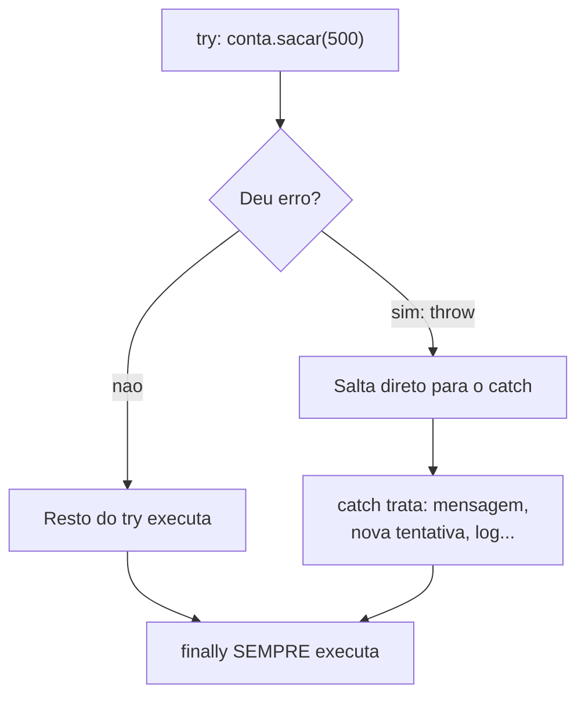

# Módulo 14 — Exceções

O que uma conta bancária deve fazer quando alguém tenta sacar mais do que o saldo? Até agora, nossos objetos simplesmente ignoravam a operação em silêncio — e quem chamou fica sem saber que falhou. Neste módulo os objetos aprendem a **avisar que algo deu errado**, do jeito Java: lançando exceções.

## Objetivos de aprendizagem

Ao final deste módulo você será capaz de:

- [ ] Tratar erros com `try/catch/finally`
- [ ] Lançar exceções com `throw` e declará-las com `throws`
- [ ] Criar exceções personalizadas com nome e dados do seu domínio
- [ ] Explicar a diferença entre exceção verificada (checked) e não verificada (unchecked)

## Pré-requisitos

[Módulo 13](../modulo-13-interfaces/) concluído. (Exceções também usam herança: toda exceção estende `Exception` ou `RuntimeException`.)

## Conceito

### O problema do silêncio

Olhe a `Conta` que usaremos no módulo 10:

```java
public void sacar(double valor) {
    if (valor > 0 && valor <= saldo) {
        saldo -= valor;
    }
    // se o valor for invalido... nada acontece. NINGUEM fica sabendo.
}
```

Isso é um bug esperando para acontecer: o caixa eletrônico mostraria "operação concluída" sem ter sacado nada. O objeto precisa de um jeito de **recusar E comunicar**. Retornar `false`? Ajuda, mas é fácil de ignorar. A solução idiomática do Java é mais enfática:

```java
public void sacar(double valor) throws SaldoInsuficienteException {
    if (valor > saldo) {
        throw new SaldoInsuficienteException(saldo, valor);   // PARA TUDO e avisa
    }
    saldo -= valor;
}
```

### O fluxo do try/catch



Três blocos, três papéis:

- `try` — o código que PODE falhar.
- `catch` — o plano B; recebe o objeto-exceção com os detalhes do erro.
- `finally` — a arrumação final, executa COM ou SEM erro (fechar Scanner, arquivo, conexão).

### Exceções são objetos (e isso é ótimo)

Uma exceção personalizada é uma classe como outra qualquer — pode ter atributos, construtor e métodos:

```java
public class SaldoInsuficienteException extends Exception {
    private double saldoAtual;
    private double valorSolicitado;
    // construtor monta a mensagem; getValorFaltante() ajuda quem tratar
}
```

Compare `SaldoInsuficienteException` com um genérico `Exception("erro")`: o nome já diz o que houve, e os atributos permitem que o `catch` reaja de forma inteligente ("faltaram R$ 400,00").

### Checked × unchecked

| | Checked (verificada) | Unchecked (não verificada) |
| --- | --- | --- |
| Estende | `Exception` | `RuntimeException` |
| Compilador obriga tratar? | SIM (try/catch ou repassar com `throws`) | Não |
| Use para | Falhas esperadas do negócio (saldo insuficiente) | Erros de programação (valor negativo onde nunca deveria chegar) |
| No exemplo | `SaldoInsuficienteException` | `ValorInvalidoException` |

Você já conhece unchecked de vista: `NullPointerException` e `IndexOutOfBoundsException` são `RuntimeException` que o Java lança sozinho.

## Exemplo guiado

Repare no pacote novo, `exception/` — a partir de agora exceções personalizadas têm casa própria:

- [exception/SaldoInsuficienteException.java](exemplo/exception/SaldoInsuficienteException.java) — checked, com atributos úteis.
- [exception/ValorInvalidoException.java](exemplo/exception/ValorInvalidoException.java) — unchecked.
- [model/ContaSimples.java](exemplo/model/ContaSimples.java) — a conta que avisa em vez de silenciar.
- [app/TesteExcecoes.java](exemplo/app/TesteExcecoes.java) — quatro cenários: sucesso, saldo insuficiente, valor inválido e o `finally`.

```bash
cd exemplo
javac -d bin exception/*.java model/*.java app/*.java
java -cp bin app.TesteExcecoes
```

Experimento: no `TesteExcecoes`, remova o try/catch do TESTE 2 e compile. O compilador vai recusar — essa é a exceção CHECKED trabalhando. Depois remova o do TESTE 3: compila normal (unchecked), mas o programa morre no meio ao executar. Sinta a diferença na prática.

## Exercícios

1. [EXERCICIO-01-caixa-eletronico.md](exercicios/EXERCICIO-01-caixa-eletronico.md) — um caixa eletrônico que trata todas as falhas com exceções personalizadas.

## Auto-avaliação

- [ ] Sei escrever try/catch/finally e prever a ordem de execução em cada cenário
- [ ] Sei a diferença entre `throw` (lançar) e `throws` (declarar no método)
- [ ] Criei uma exceção personalizada com atributos próprios
- [ ] Sei decidir entre checked e unchecked para um caso novo

## Erros comuns

| Erro | O que está acontecendo |
| --- | --- |
| `unreported exception ... must be caught or declared` | Método chama algo que lança checked exception: trate com try/catch ou declare `throws` |
| `catch` vazio (`catch (Exception e) {}`) | Engolir erro é pior que não tratar: o programa falha em silêncio — exatamente o problema que viemos resolver |
| Capturar `Exception` genérica sempre | Captura demais; prefira o tipo específico para tratar cada erro do seu jeito |
| Usar exceção para fluxo normal (ex.: sair de um laço) | Exceção é para situação EXCEPCIONAL; para fluxo normal use if/return |

---

Anterior: [Módulo 13](../modulo-13-interfaces/) | Próximo: [Módulo 15 — Refatoração](../modulo-15-refatoracao/)
