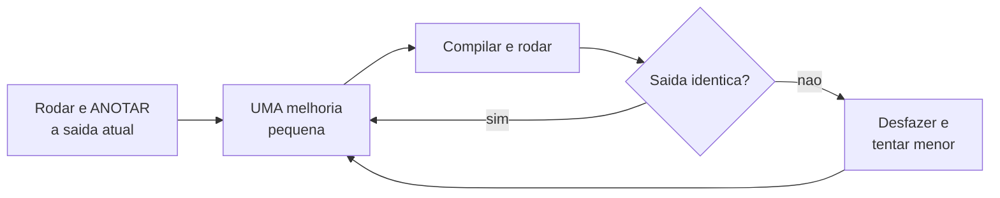

# Módulo 15 — Refatoração: de código que funciona para código bom

Você já sabe todos os conceitos de POO dos módulos anteriores. Este módulo ensina uma habilidade diferente, e talvez a mais usada na vida profissional: **melhorar código existente sem mudar o que ele faz**. É aqui que a POO deixa de ser sintaxe e vira ferramenta de pensamento.

## Objetivos de aprendizagem

Ao final deste módulo você será capaz de:

- [ ] Identificar sinais de código com problema: duplicação, main gigante, variáveis numeradas
- [ ] Extrair um trecho repetido para um método (extração de método)
- [ ] Extrair dados + comportamento relacionados para uma classe (extração de classe)
- [ ] Aplicar o princípio DRY (Don't Repeat Yourself, não se repita)
- [ ] Refatorar em passos pequenos, testando a cada passo

## Pré-requisitos

[Módulo 14](../modulo-14-excecoes/) concluído.

## Conceito

### Refatorar não é reescrever

Refatoração tem uma regra sagrada: **o comportamento observável não muda**. Antes e depois, o programa imprime as mesmas coisas para as mesmas entradas. O que muda é a estrutura interna, e portanto o custo de dar manutenção amanhã.

### Os "cheiros" de código (code smells)

Sinais de que um código pede refatoração. Aprenda a farejá-los:

| Cheiro | Como reconhecer |
| --- | --- |
| Código duplicado | O mesmo bloco copiado e colado, com pequenas variações |
| Variáveis numeradas | `nome1, nome2, nome3...`, implorando para virar objetos numa lista |
| Main gigante | Um método que faz tudo: lê, calcula, valida, imprime |
| Números mágicos | `if (media >= 6.0)`. O que é 6.0? Por que 6.0? |
| Nomes vagos | `x`, `aux`, `dados2`, `metodo1` |

### O processo, passo a passo

Nunca refatore tudo de uma vez. O ciclo seguro é:



### O exemplo do módulo, em três atos

Abra [exemplo/antes/SistemaNotas.java](exemplo/antes/SistemaNotas.java): um sistema de notas com três alunos, todo dentro do `main`, com o cálculo de média e a regra de aprovação **copiados três vezes**.

**Ato 1: Extração de método.** O bloco que calcula média e situação é idêntico nos três alunos; só mudam os valores. Primeiro passo natural:

```java
static String calcularSituacao(double media) {
    if (media >= 6.0) return "Aprovado";
    if (media >= 4.0) return "Recuperacao";
    return "Reprovado";
}
```

Já elimina a duplicação da REGRA. Mas os dados (`nome1`, `prova1a`...) continuam soltos e numerados: o cheiro persiste.

**Ato 2: Extração de classe.** A pergunta-chave da POO: *quais dados andam sempre juntos, e que comportamento pertence a eles?* Nome e notas andam juntos; média e situação são calculadas A PARTIR deles. Isso é uma classe pedindo para existir, em [exemplo/depois/model/Aluno.java](exemplo/depois/model/Aluno.java):

- `nome1, prova1a, prova1b, trabalho1` viram `new Aluno("Ana")` + `adicionarNota(...)`
- o cálculo repetido vira o método `calcularMedia()`
- a regra de aprovação vira `getSituacao()`, escrita UMA vez, no único lugar lógico

**Ato 3: Mais uma classe.** A média da turma era uma conta solta no fim do main. De quem é essa responsabilidade? Da [Turma](exemplo/depois/model/Turma.java). Resultado final em [exemplo/depois/app/SistemaNotas.java](exemplo/depois/app/SistemaNotas.java): um main que só monta objetos e delega.

Execute os dois e compare as saídas, devem ser equivalentes:

```bash
cd exemplo/antes
javac SistemaNotas.java && java SistemaNotas

cd ../depois
javac -d bin model/*.java app/*.java
java -cp bin app.SistemaNotas
```

### O teste do "e se mudar?"

A prova de que a refatoração valeu a pena é perguntar "e se...":

| Mudança pedida | Versão antes | Versão depois |
| --- | --- | --- |
| Nota de corte vira 7.0 | Alterar em 3 lugares (esquecer 1 = bug) | Alterar 1 linha em `getSituacao()` |
| Adicionar 4o aluno | Copiar e colar 15 linhas, renumerar tudo | 3 linhas: `new`, notas, `matricular` |
| Aluno com 4 notas | Reescrever a fórmula da média daquele aluno | Nada muda: a lista aceita N notas |

## Exercícios

1. [EXERCICIO-01-refatorar-farmacia.md](exercicios/EXERCICIO-01-refatorar-farmacia.md): você recebe um código monolítico funcionando e o transforma em POO, nos mesmos três atos.

## Auto-avaliação

- [ ] Sei apontar pelo menos três cheiros num código monolítico
- [ ] Sei a diferença entre extração de método e extração de classe, e quando cada uma basta
- [ ] Refatorei mantendo a saída idêntica (comparei de verdade)
- [ ] Sei explicar DRY com um exemplo concreto de custo de manutenção

## Erros comuns

| Erro | O que está acontecendo |
| --- | --- |
| Refatorar e "aproveitar para melhorar" o comportamento | Duas mudanças ao mesmo tempo: se quebrar, você não sabe qual foi |
| Extrair métodos que só repassam parâmetros entre si | Sinal de que os dados pedem uma CLASSE, não mais métodos |
| Criar classes para tudo (`CalculadoraDeMedia`, `ImpressoraDeBoletim`...) | Fragmentação excessiva; comece pelo que os dados pedem |
| Refatorar sem rodar o programa antes | Sem a saída original anotada, você não tem como saber se preservou o comportamento |

---

Anterior: [Módulo 14](../modulo-14-excecoes/) | Próximo: [Módulo 16 — Estudo de caso: banco](../modulo-16-estudo-de-caso-banco/)
